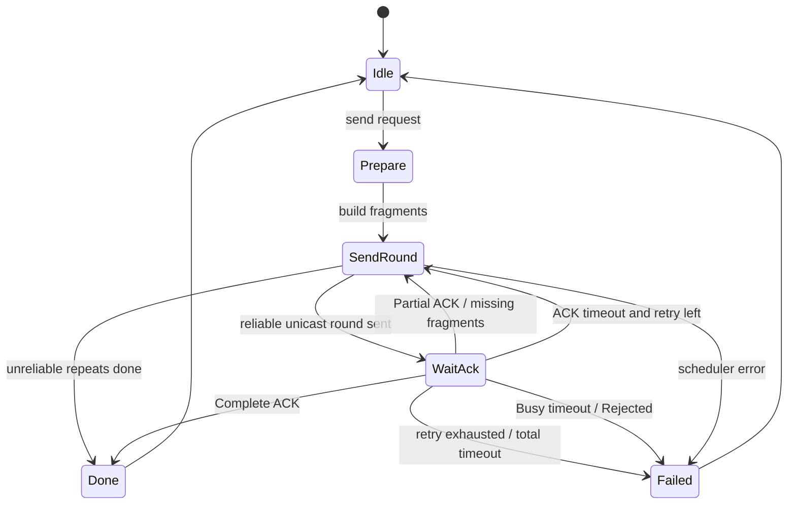
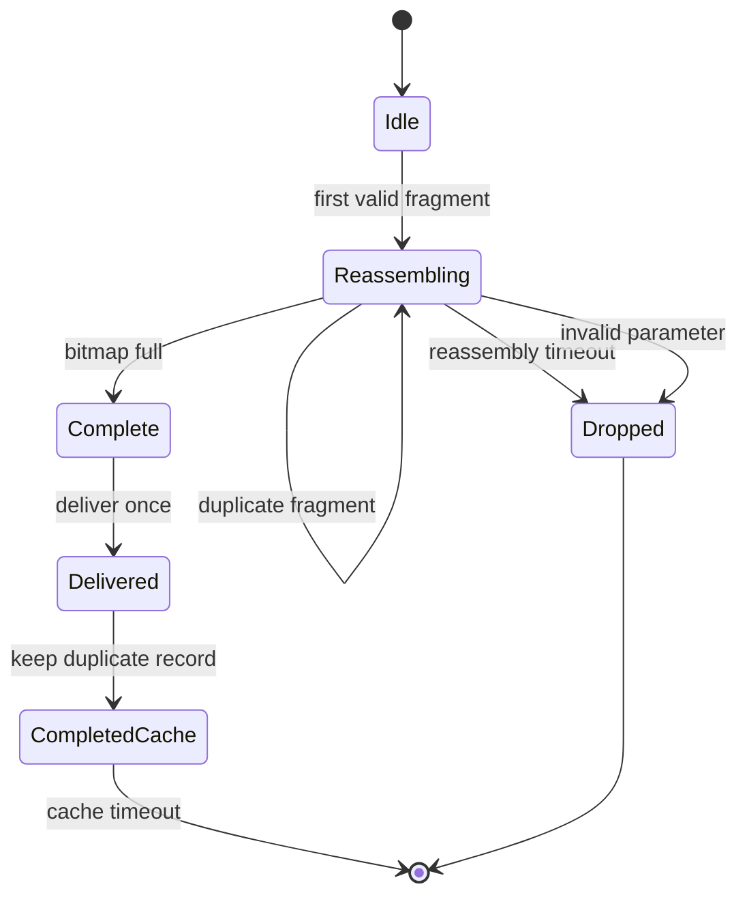

# 蓝牙吊坠 P2P 可靠分片传输协议设计

## 1. 目标

本文定义吊坠设备之间基于 BLE Extended Advertising 的 P2P 可靠传输层。

目标：

- 支持超过单帧长度的上层消息。
- 支持分片、乱序接收、重组、去重、ACK、缺片重传、超时丢弃。
- 继续复用现有 `PENDANT-ADV` 下层帧头，不重复携带已有字段。
- 尽量保持每个 DATA 分片的上层有效载荷接近当前实测上限。
- 第一版优先支持可靠单播；广播消息默认不 ACK，避免 ACK 风暴。

当前实测约束：

```text
B85 扩展扫描可稳定上报 Adv Data 总长度   229 bytes
BLE Manufacturer AD overhead              4 bytes
PENDANT-ADV header                        50 bytes
PENDANT-ADV frame CRC32                   4 bytes
PENDANT-ADV payload max                   171 bytes
P2P common header                         8 bytes
P2P DATA fragment body max                163 bytes
```

因此第一版 P2P DATA 分片的最大上层 chunk 长度仍定为：

```text
APP_PEER_FRAGMENT_BODY_MAX = 163 bytes
```

## 2. 分层关系

```text
BLE Extended Advertising Data
  -> Manufacturer Specific AD Structure
    -> PENDANT-ADV frame
      -> P2P reliable transport payload
        -> upper application message
```

下层 `PENDANT-ADV` 已有字段：

| 字段 | 长度 | P2P 用法 |
| --- | ---: | --- |
| Frame Type | 1 | `DATA` / `ACK` / `CTRL` / `ERROR` |
| Flags | 1 | 复用 bit0 作为 Ack Required |
| Frame Seq | 2 | 广播帧序号，用于调试和底层去重辅助 |
| Source EID | 16 | 发送方身份 |
| Destination EID | 16 | 接收方身份，全 0 表示广播 |
| Message ID | 4 | 一条完整 P2P 消息的 ID |
| Fragment Index | 1 | 当前分片序号，从 0 开始 |
| Fragment Count | 1 | 总分片数 |
| Payload Length | 1 | P2P payload 长度 |
| Header CRC8 / Frame CRC32 | 5 | 下层完整性校验 |

P2P 层不再重复携带 `message_id`、`fragment_index`、`fragment_count`、`src_eid`、`dst_eid`。

## 3. P2P 公共头

P2P payload 的前 8 字节为公共头。该头沿用现有 P2P 头长度，避免继续增加每片开销。

| 偏移 | 字段 | 长度 | DATA 帧含义 | ACK 帧含义 |
| ---: | --- | ---: | --- | --- |
| 0 | Magic Lo | 1 | 固定 `0x50`，ASCII `P` | 固定 `0x50` |
| 1 | Magic Hi | 1 | 固定 `0x54`，ASCII `T` | 固定 `0x54` |
| 2 | P2P Version | 1 | `0x02` | `0x02` |
| 3 | Type | 1 | 上层消息类型 | ACK Status |
| 4 | P2P Seq Lo | 1 | 本机 P2P 帧序号低字节 | ACK 本机序号低字节 |
| 5 | P2P Seq Hi | 1 | 本机 P2P 帧序号高字节 | ACK 本机序号高字节 |
| 6 | Body Length | 1 | 公共头之后的字节数 | ACK body 字节数 |
| 7 | P2P Flags | 1 | 传输标志 | ACK 标志 |

P2P Flags：

| bit | 名称 | DATA 用法 |
| ---: | --- | --- |
| 0 | Reliable | 需要 ACK 和重传；必须和下层 `Ack Required` 一致 |
| 1 | Notify Host | 完成或失败时需要通知上位机 |
| 2 | High Priority | 高优先级消息，调度时优先于普通消息 |
| 3 | No Fragment Cache | 单帧即时消息，不进入长消息重组缓存 |
| 4 | Message CRC Present | 第 0 片 body 前 4 字节携带整包 CRC32 |
| 5 | Reserved | 保留 |
| 6 | Reserved | 保留 |
| 7 | Reserved | 保留 |

默认可靠长消息不启用 `Message CRC Present`，因为每个 `PENDANT-ADV` 分片已经有 Frame CRC32，且下层 CRC 覆盖 Header 和 Payload。若后续需要更强的整包校验，可打开 bit4，但第 0 片可承载的业务数据会减少 4 字节。

## 4. DATA 分片格式

下层：

```text
PENDANT-ADV.Frame Type       = DATA
PENDANT-ADV.Message ID       = 当前完整消息 ID
PENDANT-ADV.Fragment Index   = 当前分片序号
PENDANT-ADV.Fragment Count   = 总分片数
PENDANT-ADV.Flags bit0       = 是否需要 ACK
PENDANT-ADV.Source EID       = 发送方
PENDANT-ADV.Destination EID  = 接收方；全 0 表示广播
```

P2P payload：

```text
P2P common header, 8 bytes
optional message CRC32, only fragment 0 and Message CRC Present = 1
chunk data
```

无整包 CRC 时：

```text
chunk_len = P2P.Body Length
chunk_max = 163 bytes
```

启用整包 CRC 时：

```text
fragment 0:
  body[0..3] = Message CRC32
  chunk_len  = P2P.Body Length - 4
  chunk_max  = 159 bytes

fragment 1..N:
  chunk_len = P2P.Body Length
  chunk_max = 163 bytes
```

分片数限制：

| 项 | 协议上限 | 第一版固件默认 |
| --- | ---: | ---: |
| Fragment Count | 32 | 2 |
| 可靠单播消息长度 | 32 * 163 = 5216 bytes | 256 bytes |
| 非可靠广播消息长度 | 32 * 163 = 5216 bytes | 256 bytes |
| 并发 TX 任务 | 实现决定 | 1 |
| 并发 RX 重组任务 | 实现决定 | 1 |

说明：

- 协议 ACK bitmap 使用 32 bit，因此协议上限为 32 片。
- 固件第一版默认限制为 2 片和 256 字节，主要是为了控制 B85 SRAM 使用量和调试复杂度。该版本用于先验证分片、组包、ACK 和重传主流程，后续可通过 SRAM 优化提高到 512 或 1024 字节。
- 上层如果发送 `len <= 163` 的单帧消息，`fragment_count = 1`，`fragment_index = 0`。

## 5. ACK 帧格式

ACK 使用下层 `PENDANT-ADV` 的 `ADV_FRAME_ACK`，不占用 DATA 消息类型空间。

下层：

```text
PENDANT-ADV.Frame Type       = ACK
PENDANT-ADV.Source EID       = 原 DATA 接收方
PENDANT-ADV.Destination EID  = 原 DATA 发送方
PENDANT-ADV.Message ID       = 被确认的 Message ID
PENDANT-ADV.Fragment Index   = 0
PENDANT-ADV.Fragment Count   = 1
```

ACK P2P common header：

| 字段 | 用法 |
| --- | --- |
| Type | ACK Status |
| P2P Seq | ACK 发送方本地序号 |
| Body Length | 固定 8 |
| P2P Flags | 保留，第一版为 0 |

ACK body：

| 偏移 | 字段 | 长度 | 说明 |
| ---: | --- | ---: | --- |
| 0 | Original App Type | 1 | 被确认 DATA 的上层消息类型 |
| 1 | Fragment Count | 1 | 被确认消息的总分片数 |
| 2 | Received Bitmap | 4 | bit0 对应 fragment 0，1 表示已收到 |
| 6 | First Missing Index | 1 | 第一个缺片序号；全部收到为 `0xFF` |
| 7 | Reason / Retry After | 1 | Busy/Rejected 原因，或建议等待时间单位 |

ACK Status：

| 值 | 名称 | 说明 |
| ---: | --- | --- |
| `0x00` | Partial | 已收到部分分片，bitmap 表示当前进度 |
| `0x01` | Complete | 已完整收齐并投递给上层 |
| `0x02` | Duplicate Complete | 该消息之前已完整处理过，再次收到重复分片 |
| `0x03` | Busy | RX 重组缓存不足，发送方稍后重试 |
| `0x04` | Rejected | 参数非法或策略拒绝 |
| `0x05` | Timeout | 接收端重组超时，任务已丢弃 |
| `0x06` | Canceled | 对端取消 |

## 6. 可靠性策略

### 6.1 可靠单播

可靠单播条件：

```text
Destination EID != all-zero
PENDANT-ADV.Flags bit0 Ack Required = 1
P2P Flags bit0 Reliable = 1
```

规则：

- 接收端对每个合法分片更新 RX bitmap。
- 接收端允许乱序到达。
- 接收端收到新分片后，在 ACK debounce 时间内发送 Partial ACK 或 Complete ACK。
- 发送端根据 ACK bitmap 只重传缺失分片。
- 如果 ACK 丢失，发送端超时后重传；接收端如果已经完成，应回复 Duplicate Complete 或 Complete ACK。
- 完成消息只投递上层一次。

### 6.2 非可靠单播

非可靠单播条件：

```text
Destination EID != all-zero
Ack Required = 0
Reliable = 0
```

规则：

- 发送端按固定重复次数广播所有分片。
- 接收端能收齐则投递，未收齐则超时丢弃。
- 不产生 ACK，不重传缺片。

### 6.3 非可靠广播

非可靠广播条件：

```text
Destination EID = all-zero
Ack Required = 0
Reliable = 0
```

规则：

- 用于状态通知、发现辅助、调试广播等。
- 每个分片重复固定次数。
- 接收端按 `Source EID + Message ID` 去重和重组。
- 不产生 ACK。

### 6.4 可靠广播

第一版不支持可靠广播。

原因：

- 多个接收端同时 ACK 会造成 ACK 风暴。
- 广播接收端集合不确定，发送方无法判断何时完成。

如果后续需要可靠群发，应设计成“逐个单播确认”或“组内指定 ACK 代表”。

## 7. TX 状态机



TX 任务字段：

| 字段 | 说明 |
| --- | --- |
| dst_eid | 目标 EID |
| message_id | 当前消息 ID |
| app_type | 上层消息类型 |
| flags | P2P flags |
| payload_len | 上层完整消息长度 |
| fragment_count | 总分片数 |
| ack_bitmap | 已被对端确认的分片 |
| pending_bitmap | 本轮待发送分片 |
| retry_round | 当前重传轮次 |
| first_tick | 任务创建时间 |
| last_tx_tick | 最近一次分片发送时间 |
| last_ack_tick | 最近一次 ACK 时间 |

TX 默认参数：

| 参数 | 默认值 | 说明 |
| --- | ---: | --- |
| Fragment repeat per round | 2 | 每轮每个待发分片重复发送次数 |
| ACK wait timeout | 800 ms | 一轮发送后等待 ACK |
| Max retry rounds | 4 | 超过后失败 |
| Total TX timeout | 10000 ms | 单消息总超时 |
| Reliable TX contexts | 1 | 第一版只并发 1 条可靠消息 |

发送轮规则：

1. 第 0 轮发送全部分片。
2. 收到 Partial ACK 后，将 `pending_bitmap = all_fragments & ~received_bitmap`。
3. 后续只发送缺失分片。
4. 收到 Complete ACK 后结束任务。
5. 无 ACK 超时则重发当前 `pending_bitmap`；如果从未收到 ACK，则重发全部分片。

## 8. RX 状态机



RX 重组键：

```text
Source EID + Destination EID + Message ID + App Type
```

RX 上下文字段：

| 字段 | 说明 |
| --- | --- |
| src_eid | 发送方 |
| dst_eid | 目标 |
| message_id | 消息 ID |
| app_type | 上层类型 |
| fragment_count | 总片数 |
| received_bitmap | 已收到分片 |
| fragment_len[] | 每片 chunk 长度 |
| buffer | 重组缓存 |
| first_tick | 第一次收到该消息的时间 |
| last_progress_tick | 最近一次收到新分片的时间 |
| last_ack_tick | 最近一次发 ACK 的时间 |
| reliable | 是否需要 ACK |

RX 默认参数：

| 参数 | 默认值 | 说明 |
| --- | ---: | --- |
| RX contexts | 1 | 并发接收 1 条消息 |
| RX message max | 256 bytes | 第一版上层消息上限 |
| RX reassembly timeout | 8000 ms | 从首片开始计时 |
| RX idle timeout | 3000 ms | 长时间无新分片则丢弃 |
| ACK debounce | 100 ms | 合并频繁 ACK |
| Complete ACK repeat | 3 次 | 降低 Complete ACK 丢失概率 |
| Completed cache size | 8 | 已完成消息去重记录 |
| Completed cache TTL | 30000 ms | 重复消息窗口 |

RX 处理规则：

1. 校验下层 `PENDANT-ADV` CRC 和目的 EID。
2. 校验 P2P magic、version、body length。
3. 拒绝 `fragment_count == 0` 或超过当前固件上限的消息。
4. 拒绝 `fragment_index >= fragment_count` 的分片。
5. 按 RX 重组键查找上下文。
6. 找不到上下文时，如果有空位则创建，否则回复 Busy ACK。
7. 同一分片重复到达时只更新去重计数，不重复写入 buffer。
8. 新分片写入 buffer，并设置 bitmap。
9. 未收齐时按 debounce 策略发送 Partial ACK。
10. 收齐后按分片序号拼接，投递上层一次。
11. 可靠单播收齐后发送 Complete ACK，并重复发送数次。
12. 已完成消息再次收到重复分片时，回复 Duplicate Complete 或 Complete ACK。

## 9. 乱序处理

接收端不要求分片按序到达。

每个分片的写入位置由前面分片长度决定。第一版为了简化实现，建议采用固定 chunk 槽位：

```text
slot_offset = fragment_index * APP_PEER_FRAGMENT_BODY_MAX
```

最终投递给上层时，再按 `fragment_len[]` 逐片紧凑拷贝：

```text
for i in 0..fragment_count-1:
    append buffer[i * 163 : i * 163 + fragment_len[i]]
```

优点：

- 乱序写入简单。
- 不需要提前知道完整消息长度。
- 不需要在每片重复携带 offset。

代价：

- RX buffer 按最大槽位预留，第一版通过 `1024 bytes / 8 fragments` 控制 SRAM 占用。

## 10. 去重策略

### 10.1 分片去重

同一个 RX 上下文内：

```text
received_bitmap bit(fragment_index) == 1
```

表示该分片已经收到。重复分片不写入 buffer，只更新统计和 ACK 机会。

### 10.2 完整消息去重

完成并投递上层后，写入 Completed Cache：

```text
Source EID + Destination EID + Message ID + App Type
```

TTL 内再次收到同一消息的分片：

- 不重复投递上层。
- 如果是可靠单播，回复 Duplicate Complete 或 Complete ACK。

### 10.3 Message ID 回绕

`message_id` 为 32 bit，发送端自增，0 保留不用。

规则：

- 启动后从非 0 值开始。
- 回绕到 0 时跳过。
- Completed Cache TTL 较短，正常情况下不会和回绕冲突。

## 11. 超时和错误处理

发送端错误：

| 条件 | 处理 |
| --- | --- |
| 上层长度超过上限 | 返回 `APP_ERR_PARAM` |
| 可靠广播 | 返回 `APP_ERR_UNSUPPORTED` |
| 调度队列长期忙 | 等待，超过 TX timeout 后失败 |
| ACK timeout | 重发缺失分片 |
| Max retry exhausted | 失败并通知上层 |
| 收到 Busy ACK | 按 Retry After 等待；总超时仍生效 |
| 收到 Rejected ACK | 立即失败 |

接收端错误：

| 条件 | 处理 |
| --- | --- |
| 目的 EID 不匹配 | 忽略业务内容 |
| P2P magic/version 不匹配 | 忽略 |
| Fragment Count 超限 | Rejected ACK |
| Fragment Index 越界 | Rejected ACK |
| Body Length 越界 | Rejected ACK |
| RX context 不足 | Busy ACK |
| RX timeout | 丢弃上下文；必要时 Timeout ACK |

## 12. 广播调度建议

当前只有一个 P2P 广播数据通道，需要由 `adv_scheduler` 轮流发送 Beacon、DATA、ACK。

建议优先级：

```text
ACK Complete / Busy / Rejected
ACK Partial
Reliable DATA retransmission
Reliable DATA first round
Unreliable DATA
Beacon
```

建议新增调度能力：

- 每个待发帧支持 `hold_ms` 或 `repeat_count`。
- P2P DATA 分片不要继续使用 3 秒 hold，否则长消息吞吐太低。
- 可靠 DATA 分片建议 hold `200-300 ms`，按 100 ms 广播间隔约等于重复 2-3 次。
- Complete ACK 建议 hold `800-1200 ms`，提高发送端结束概率。
- Beacon 不应完全停止，建议每 4-6 个 DATA/ACK 调度窗口插入 1 次 Beacon。

第一版可以采用保守轮询：

```text
每次 app_peer_transport_poll():
  如果 adv_scheduler 可接收新帧:
    先发送待发 ACK
    再发送 TX 任务当前缺失分片
    否则维持 Beacon
```

## 13. 对外接口建议

保留现有接口作为单帧测试兼容入口：

```c
app_status_t app_peer_transport_send(const app_eid_t *dst_eid,
                                     app_peer_msg_type_t type,
                                     const u8 *payload,
                                     u8 len);
```

新增长消息接口：

```c
typedef enum {
    APP_PEER_SEND_UNRELIABLE = 0,
    APP_PEER_SEND_RELIABLE = 1,
} app_peer_send_mode_t;

app_status_t app_peer_transport_send_message(const app_eid_t *dst_eid,
                                             app_peer_msg_type_t type,
                                             const u8 *payload,
                                             u16 len,
                                             app_peer_send_mode_t mode,
                                             u8 flags);
```

接收完成回调：

```c
typedef void (*app_peer_transport_rx_cb_t)(const app_eid_t *src_eid,
                                           app_peer_msg_type_t type,
                                           const u8 *payload,
                                           u16 len,
                                           s8 rssi);

void app_peer_transport_set_rx_callback(app_peer_transport_rx_cb_t cb);
```

调试信息建议扩展：

```text
tx_msg_ok
tx_msg_fail
tx_frag_sent
tx_frag_retx
tx_ack_rx
tx_ack_timeout
rx_msg_ok
rx_msg_timeout
rx_frag_new
rx_frag_dup
rx_ack_tx
rx_busy
rx_rejected
```

## 14. 兼容策略

当前固件 P2P version 为 `0x01`，只支持单帧。

可靠分片版本建议使用：

```text
P2P Version = 0x02
```

兼容处理：

- 收到 version `0x01`：按旧单帧逻辑处理。
- 收到 version `0x02`：进入可靠分片逻辑。
- 发送默认使用 `0x02`。
- 如果后续需要和旧固件互通，可在 Beacon capability 中增加 `P2P Reliable Fragment` 能力位。

## 15. 第一版开发顺序

建议按以下顺序实现和测试：

1. 定义 P2P v2 头、ACK body、常量和 debug counters。
2. 改造单帧发送，使 `fragment_count=1` 时也走 v2 解析路径。
3. 实现 RX context、乱序写入、bitmap、完成投递、超时丢弃。
4. 实现 ACK 生成和 ACK 解析，但暂不重传。
5. 实现 TX context 和 ACK bitmap 驱动的缺片重传。
6. 改造 `adv_scheduler`，支持 P2P 短 hold 或按轮发送。
7. 增加 shell 测试命令：
   - `p2psend <len> [r|u]`
   - `p2pburst <len> <count>`
   - `p2pdrop <bitmap>`，仅调试构建，用于模拟丢片。
   - `p2pstat`
8. 单板边界测试：`1, 163, 164, 256, 257`。
9. 双板乱序和重传测试。
10. 双板 `ble start` 共存测试。

## 16. 当前决策

第一版采用以下决策：

- 单分片最大 DATA body：`163 bytes`。
- 不重复携带 offset、total length、message id、fragment index、fragment count。
- 默认不携带整包 CRC32；依赖每个下层帧的 Frame CRC32。
- ACK 使用 32 bit bitmap。
- 协议最大 32 片，固件默认 2 片。
- 可靠传输只支持单播。
- 广播长消息只做重复发送和超时重组，不做 ACK。
- 完成消息必须只投递一次。

## 17. 当前固件实现参数

当前 `tc_ble_multi_sdk/vendor/pendant/peer_transport/` 中的第一版 P2P v2 实现采用以下参数：

| 参数 | 当前值 | 说明 |
| --- | ---: | --- |
| 单分片业务数据 | 163 bytes | `APP_PEER_TRANSPORT_FRAGMENT_BODY_MAX_LEN` |
| 单条消息上限 | 256 bytes | `APP_PEER_TRANSPORT_MESSAGE_MAX_LEN` |
| 单条消息最大分片数 | 2 | `APP_PEER_TRANSPORT_MAX_FRAGMENTS` |
| TX 并发消息 | 1 | 单个发送上下文 |
| RX 重组上下文 | 1 | 单个接收重组上下文 |
| Completed cache | 2 | 用于完成消息去重 |
| peer table 容量 | 8 | 为 P2P v2 缓冲释放 SRAM |
| 分片发送间隔 | 600 ms | 避免连续更新扩展广播数据导致前一片未充分上空口 |
| ACK 等待超时 | 800 ms | 超时后按 ACK bitmap 重传缺片 |
| 最大重传轮数 | 4 | 超过后发送任务失败 |
| RX 总超时 | 8000 ms | 从首片开始计时 |
| RX 空闲超时 | 3000 ms | 长时间无新分片则丢弃 |

已完成的单板验证：

- `p2psend 163 u`：1 片发送成功。
- `p2psend 164 u`：2 片发送成功。
- `p2psend 256 u`：2 片发送成功。
- `p2psend 257 u`：按预期被参数检查拒绝。

已完成的 PC 空口扫描验证：

- `p2psend 256 u` 触发后，WinRT 扫描可看到两片 DATA：
  - 第 0 片 P2P payload 长度 `171 bytes`，即 `8 + 163`。
  - 第 1 片 P2P payload 长度 `101 bytes`，即 `8 + 93`。

后续还需要双板验证：

- 非可靠广播长消息的接收重组。
- 可靠单播 ACK、缺片重传和完成去重。
- GATT 上位机连接状态下扩展广播 + 扩展扫描 + P2P v2 的共存稳定性。

已完成的双板验证：

- 两块 B85 dangle 均刷入 `Jun 20 2026 20:38:11` 构建版本。
- 非可靠广播 `p2psend 256 u`：
  - 发送端发送 2 个分片。
  - 接收端 `rx_frag=2`，`rx_msg_ok=1`，`rx_msg_len=0x100`。
- 可靠单播 `p2psend 256 r`，COM15 -> COM12：
  - 发送端 `tx_msg_ok=1`，`tx_frag=2`，`tx_retx=0`，`tx_ack=0x0c`，`tx_ack_to=0`。
  - 接收端 `rx_msg_ok=1`，`rx_frag=2`，`rx_msg_len=0x100`，`rx_ack_tx=0x0a`。
- 可靠单播 `p2psend 256 r`，COM12 -> COM15：
  - 发送端 `tx_msg_ok=1`，`tx_frag=2`，`tx_retx=0`，`tx_ack=0x0d`，`tx_ack_to=0`。
  - 接收端 `rx_msg_ok=1`，`rx_frag=2`，`rx_msg_len=0x100`，`rx_ack_tx=0x0a`。
- ACK 限流修正后，重复广播帧仍会被统计为 `rx_dup`，但不会像旧版本一样反复重置相同 ACK 任务；ACK 数已从约 `0x20+` 降到约 `0x0a-0x0d`。

已完成的人工丢片重传验证：

- 新增调试命令 `p2pdrop <frag_index>`：
  - 在接收端执行。
  - 仅对下一条可靠 P2P 消息生效。
  - 丢弃指定分片首个底层 `frame_seq` 对应的所有重复广播。
  - 重传轮次使用新的 `frame_seq`，因此会被接收端放行。
- 接收端丢第 0 片，发送端执行 `p2psend 256 r`：
  - 发送端 `tx_frag=3`，`tx_retx=1`，`tx_ack_to=1`，`tx_msg_ok=1`。
  - 接收端 `rx_dbg_drop=4`，`rx_frag=2`，`rx_msg_ok=1`，`rx_msg_len=0x100`。
- 接收端丢第 1 片，发送端执行 `p2psend 256 r`：
  - 发送端 `tx_frag=3`，`tx_retx=1`，`tx_ack_to=1`，`tx_msg_ok=1`。
  - 接收端 `rx_dbg_drop=6`，`rx_frag=2`，`rx_msg_ok=1`，`rx_msg_len=0x100`。
- 两块板均刷入 `Jun 20 2026 20:51:11` 构建后，反向验证 `COM15 -> COM12` 且接收端丢第 1 片：
  - 发送端 `tx_frag=3`，`tx_retx=1`，`tx_ack_to=1`，`tx_msg_ok=1`。
  - 接收端 `rx_dbg_drop=6`，`rx_frag=2`，`rx_msg_ok=1`，`rx_msg_len=0x100`。
- 结论：可靠单播在单片首轮丢失后，可以通过 ACK bitmap + timeout 驱动缺片重传，并最终完成重组。

仍待验证：

- GATT 上位机连接状态下扩展广播 + 扩展扫描 + P2P v2 的共存稳定性。
