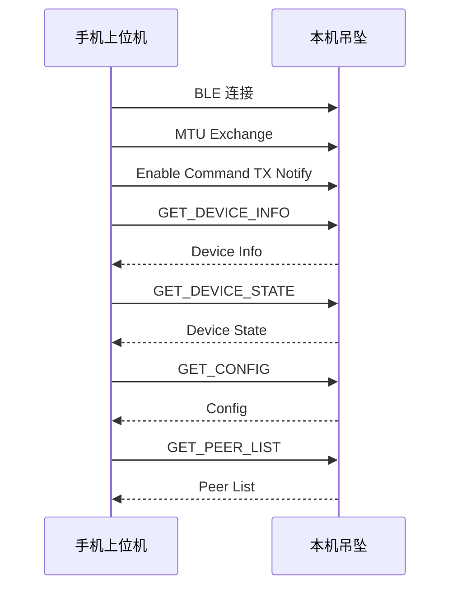
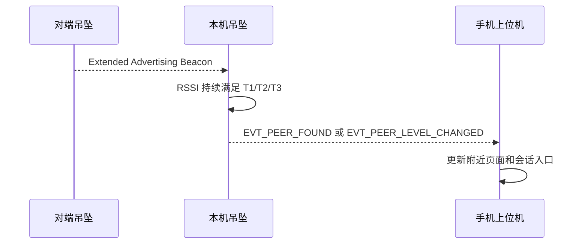
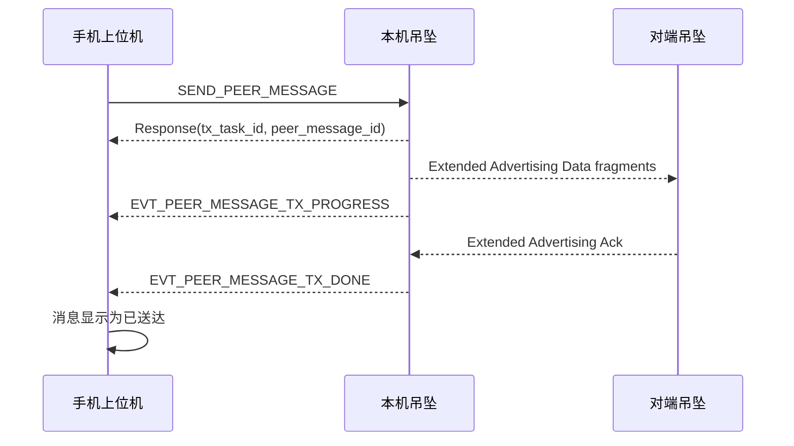
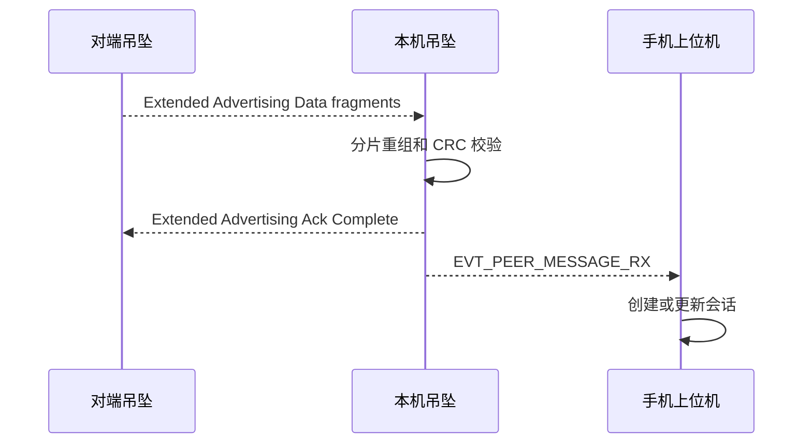

# 蓝牙吊坠上位机功能与指令协议

## 1. 设计目标

本文档定义手机上位机的产品功能、界面结构，以及手机上位机和下位机之间的 BLE GATT 指令协议。

设计原则：

- 手机上位机只连接用户自己的吊坠。
- 附近设备发现由本机吊坠完成，并通过 GATT 通知手机。
- 设备间消息由本机吊坠通过扩展广播发送和接收，手机不直接参与设备间广播解析。
- 上位机体验参考主流聊天软件，用户看到的是“附近的人/设备”和“会话”，而不是底层 BLE 包。

## 2. 产品形态

手机上位机建议采用四个主页面：

| 页面 | 作用 |
| --- | --- |
| 消息 | 会话列表，类似聊天软件首页 |
| 附近 | 显示附近吊坠设备及距离等级 |
| 设备 | 显示本机吊坠状态、连接、电量、充电、休眠 |
| 设置 | 配置发现阈值、振动、低功耗、安全和调试选项 |

底部导航建议：

```text
消息 | 附近 | 设备 | 设置
```

## 3. 用户流程

### 3.1 首次使用

1. App 请求蓝牙权限。
2. App 扫描附近可连接的吊坠。
3. 用户选择自己的吊坠。
4. App 建立 BLE 连接。
5. App 读取设备信息。
6. App 完成绑定。
7. App 进入消息首页。

待确认：

- 是否需要账号系统。
- 是否允许一个手机绑定多个吊坠。
- 是否允许一个吊坠被多个手机绑定。

### 3.2 日常使用

1. App 启动后自动连接已绑定吊坠。
2. 吊坠进入广播扫描状态。
3. 吊坠发现附近设备后通知 App。
4. App 在“附近”页面展示设备。
5. 用户可点击附近设备进入聊天。
6. 用户输入消息后，App 将消息写入本机吊坠。
7. 本机吊坠通过扩展广播发送给目标吊坠。
8. 目标吊坠收到完整消息后通知其手机。
9. 本机吊坠收到 ACK 后通知本机手机更新消息状态。

### 3.3 无手机连接时

吊坠仍应独立完成：

- 广播自身信息。
- 扫描附近设备。
- RSSI 发现状态判断。
- 马达振动提示。
- 接收设备间消息。

无手机连接期间收到的关键事件，应缓存在吊坠本地，手机下次连接后可读取最近事件。

待确认：

- 离线事件缓存条数。
- 离线消息是否需要缓存完整内容。
- 离线消息缓存是否需要加密。

## 4. 页面功能设计

### 4.1 消息页面

消息页面类似聊天软件会话列表。

每条会话显示：

- 对端昵称或短 ID。
- 对端发现等级：S1/S2/S3。
- 最近一条消息内容。
- 最近消息时间。
- 消息发送状态。
- 未读数量。
- 对端是否仍在附近。

会话排序：

1. 未读会话。
2. 最近有消息的会话。
3. 当前仍在附近的会话。
4. 历史会话。

消息状态：

| 状态 | 显示含义 |
| --- | --- |
| 草稿 | 尚未发送给吊坠 |
| 已提交 | App 已写入本机吊坠 |
| 广播中 | 本机吊坠正在扩展广播发送 |
| 等待确认 | 已发送，等待目标 ACK |
| 已送达 | 目标吊坠已 ACK |
| 失败 | 超时、对端忙、缓存不足或协议错误 |
| 已接收 | 本机吊坠收到对端消息 |

### 4.2 聊天详情页面

聊天详情页面显示与某个附近设备或历史设备的消息。

顶部区域：

- 对端昵称或短 ID。
- 当前发现等级。
- 最近 RSSI。
- 最近出现时间。
- 连接说明：通过吊坠广播通信。

消息区域：

- 文本消息气泡。
- 系统事件气泡，例如“对方进入 S2”“对方离开附近”。
- 发送状态。
- 失败重试按钮。

输入区域：

- 文本输入。
- 发送按钮。
- 可选快捷回应。

推荐限制：

- v1 文本消息最大 512 字节 UTF-8。
- 超过 512 字节时 App 提示过长。
- 由于设备间使用广播通信，不建议支持图片、语音等大数据。

### 4.3 附近页面

附近页面用于显示本机吊坠发现的其他吊坠。

建议提供两种视图：

- 列表视图。
- 雷达/分层视图。

列表视图显示：

- 对端短 ID。
- 发现等级 S1/S2/S3。
- RSSI 平滑值。
- 进入当前等级的时间。
- 最近一次出现时间。
- 是否可发送消息。

分组：

- S3：非常近。
- S2：较近。
- S1：附近。
- 已离开：最近出现过但当前不满足 S1。

用户操作：

- 点击设备进入聊天。
- 给设备设置备注名。
- 忽略该设备。
- 查看信号变化曲线。

注意：

- App 显示的附近设备来自本机吊坠的扫描结果，不依赖手机直接扫描其他吊坠。
- RSSI 只用于等级判断，不应展示成精确距离。

### 4.4 设备页面

设备页面显示本机吊坠状态。

显示内容：

- 连接状态。
- 固件版本。
- 硬件版本。
- 协议版本。
- 电池电量。
- 电池电压。
- 充电状态。
- 系统状态。
- 当前附近设备数量。
- 今日动作计数。
- 最近唤醒原因。
- 最近错误码。

用户操作：

- 重新连接。
- 断开连接。
- 测试马达。
- 进入休眠。
- 重启设备。
- 查看设备信息。
- 导出调试日志。

### 4.5 设置页面

设置项：

| 设置 | 说明 |
| --- | --- |
| 发现阈值 T1/T2/T3 | 配置 S1/S2/S3 RSSI 阈值 |
| 进入确认 Tin | RSSI 达标后持续多久进入更近等级 |
| 退出确认 Tout | RSSI 低于阈值后持续多久回退 |
| 振动提醒 | 开启或关闭马达提示 |
| 休眠时间 | 无动作、无附近设备时多久休眠 |
| 手机空闲超时 | 手机长时间无通信后是否断开 |
| 广播间隔 | 正常广播间隔 |
| 消息可靠发送 | 默认是否要求 ACK |
| 隐私模式 | 静态 EID 或滚动 EID |
| 调试日志 | 开启 UART 或 App 日志 |

设置修改后流程：

1. App 写入配置到吊坠 RAM。
2. 吊坠校验参数范围。
3. 吊坠返回结果。
4. App 请求保存到 Flash。
5. 吊坠保存成功后通知配置变更。

## 5. 手机端数据模型

### 5.1 LocalDevice

| 字段 | 说明 |
| --- | --- |
| device_id | 本机设备派生 ID |
| ble_address | BLE 地址 |
| name | 用户备注名 |
| fw_version | 固件版本 |
| hw_version | 硬件版本 |
| protocol_version | 协议版本 |
| bind_time | 绑定时间 |
| last_connected_at | 最近连接时间 |

### 5.2 PeerDevice

| 字段 | 说明 |
| --- | --- |
| peer_eid | 对端当前 EID |
| short_id | 显示用短 ID |
| nickname | 用户备注 |
| level | S1/S2/S3/离开 |
| rssi | 最近 RSSI |
| rssi_avg | 平滑 RSSI |
| first_seen_at | 首次发现时间 |
| last_seen_at | 最近发现时间 |
| ignored | 是否忽略 |

### 5.3 Conversation

| 字段 | 说明 |
| --- | --- |
| conversation_id | 会话 ID |
| peer_eid | 对端 EID |
| title | 会话标题 |
| last_message | 最近消息 |
| last_message_at | 最近消息时间 |
| unread_count | 未读数 |

### 5.4 Message

| 字段 | 说明 |
| --- | --- |
| message_id | App 本地消息 ID |
| peer_message_id | 下位机设备间 Message ID |
| conversation_id | 会话 ID |
| direction | 发送或接收 |
| type | 文本、二进制、事件 |
| content | 消息内容 |
| status | 草稿、广播中、已送达、失败 |
| created_at | 创建时间 |
| updated_at | 更新时间 |

## 6. BLE GATT 服务设计

建议定义一个产品专用 128bit GATT Service。

Service 名称：

- Pendant Control Service

Service UUID：

- 待正式分配。
- 开发阶段建议使用固定 128bit UUID，不使用 SIG 标准 UUID。

建议特征：

| 特征 | 属性 | 方向 | 用途 |
| --- | --- | --- | --- |
| Device Info | Read | 下位机到上位机 | 读取设备固定信息 |
| Device State | Read, Notify | 下位机到上位机 | 读取和通知设备状态 |
| Command RX | Write, Write Without Response | 上位机到下位机 | App 下发命令 |
| Command TX | Notify | 下位机到上位机 | 命令响应和事件通知 |
| Config | Read, Write | 双向 | 快速读取和写入配置快照 |
| Debug Log | Notify | 下位机到上位机 | 调试日志，量产可关闭 |

说明：

- `Command RX` 和 `Command TX` 是主要控制通道。
- 大部分业务都通过统一命令帧承载，避免 GATT 特征数量过多。
- `Device Info` 和 `Device State` 保留为只读/通知特征，方便 App 快速初始化 UI。

## 7. 上下位机命令帧

### 7.1 Host Frame 格式

`Command RX` 和 `Command TX` 使用统一 Host Frame。

| 偏移 | 字段 | 长度 | 说明 |
| ---: | --- | ---: | --- |
| 0 | Magic | 2 | 固定 `0x50 0x48`，ASCII 为 `PH` |
| 2 | Protocol Version | 1 | 当前 `0x01` |
| 3 | Frame Type | 1 | Request、Response、Event |
| 4 | Flags | 1 | 标志位 |
| 5 | Seq | 2 | 上位机生成的请求序号，事件由下位机生成 |
| 7 | Command ID | 2 | 命令或事件 ID |
| 9 | Payload Length | 2 | Payload 长度 |
| 11 | Payload | 可变 | 命令载荷 |
| 11+N | CRC16 | 2 | Header + Payload CRC16 |

Frame Type：

| 值 | 名称 | 说明 |
| ---: | --- | --- |
| `0x01` | Request | 上位机请求 |
| `0x02` | Response | 下位机响应 |
| `0x03` | Event | 下位机主动事件 |

Flags：

| bit | 说明 |
| ---: | --- |
| 0 | 需要响应 |
| 1 | 响应成功 |
| 2 | 响应失败 |
| 3 | Payload 为 TLV |
| 4 | Payload 分片 |
| 5 | 保留 |
| 6 | 保留 |
| 7 | 保留 |

### 7.2 分片规则

如果 Host Frame 超过当前 ATT MTU 可承载长度，需要分片。

建议：

- App 连接后优先发起 MTU 交换。
- 目标 MTU 建议不小于 185。
- 若 MTU 仍较小，使用命令级分片。

分片命令：

- `CMD_HOST_FRAGMENT_START`
- `CMD_HOST_FRAGMENT_DATA`
- `CMD_HOST_FRAGMENT_END`

普通命令 v1 应尽量控制在单个 GATT 写入内。

## 8. 通用响应格式

所有 Response Payload 前 4 字节建议统一：

| 偏移 | 字段 | 长度 | 说明 |
| ---: | --- | ---: | --- |
| 0 | Status | 1 | 0 成功，非 0 失败 |
| 1 | Error Code | 2 | 错误码 |
| 3 | Reserved | 1 | 保留 |
| 4 | Data | 可变 | 响应数据 |

Status：

| 值 | 说明 |
| ---: | --- |
| `0x00` | 成功 |
| `0x01` | 参数错误 |
| `0x02` | 当前状态不允许 |
| `0x03` | 忙 |
| `0x04` | 不支持 |
| `0x05` | 校验失败 |
| `0x06` | Flash 写失败 |
| `0x07` | 权限不足 |
| `0x08` | 超时 |

## 9. 命令列表

### 9.1 系统命令

| Command ID | 名称 | 方向 | 说明 |
| ---: | --- | --- | --- |
| `0x0001` | `GET_DEVICE_INFO` | App -> Device | 读取设备信息 |
| `0x0002` | `GET_DEVICE_STATE` | App -> Device | 读取当前状态 |
| `0x0003` | `SET_TIME` | App -> Device | 设置设备时间基准 |
| `0x0004` | `REBOOT` | App -> Device | 重启设备 |
| `0x0005` | `ENTER_SLEEP` | App -> Device | 请求进入休眠 |
| `0x0006` | `GET_ERROR` | App -> Device | 读取当前错误 |
| `0x0007` | `CLEAR_ERROR` | App -> Device | 清除可恢复错误 |

### 9.2 配置命令

| Command ID | 名称 | 方向 | 说明 |
| ---: | --- | --- | --- |
| `0x0101` | `GET_CONFIG` | App -> Device | 读取配置 |
| `0x0102` | `SET_CONFIG` | App -> Device | 写入 RAM 配置 |
| `0x0103` | `SAVE_CONFIG` | App -> Device | 保存配置到 Flash |
| `0x0104` | `RESET_CONFIG` | App -> Device | 恢复默认配置 |

### 9.3 发现命令

| Command ID | 名称 | 方向 | 说明 |
| ---: | --- | --- | --- |
| `0x0201` | `GET_PEER_LIST` | App -> Device | 读取附近设备列表 |
| `0x0202` | `GET_PEER_DETAIL` | App -> Device | 读取单个对端详情 |
| `0x0203` | `CLEAR_PEER` | App -> Device | 删除指定对端记录 |
| `0x0204` | `SET_DISCOVERY_ENABLE` | App -> Device | 开关发现功能 |
| `0x0205` | `SET_VIBRATION_ENABLE` | App -> Device | 开关发现振动 |

### 9.4 消息命令

| Command ID | 名称 | 方向 | 说明 |
| ---: | --- | --- | --- |
| `0x0301` | `SEND_PEER_MESSAGE` | App -> Device | 发送设备间消息 |
| `0x0302` | `CANCEL_PEER_MESSAGE` | App -> Device | 取消发送任务 |
| `0x0303` | `GET_PEER_MESSAGE_STATUS` | App -> Device | 查询发送状态 |
| `0x0304` | `GET_OFFLINE_MESSAGES` | App -> Device | 读取离线收到的消息 |
| `0x0305` | `ACK_APP_MESSAGE` | App -> Device | App 确认已读取事件或消息 |

### 9.5 电池和外设命令

| Command ID | 名称 | 方向 | 说明 |
| ---: | --- | --- | --- |
| `0x0401` | `GET_BATTERY` | App -> Device | 读取电池状态 |
| `0x0402` | `GET_CHARGE_STATE` | App -> Device | 读取充电状态 |
| `0x0501` | `MOTOR_TEST` | App -> Device | 测试马达 |
| `0x0502` | `GET_MOTION_COUNTER` | App -> Device | 读取动作计数 |

### 9.6 调试命令

| Command ID | 名称 | 方向 | 说明 |
| ---: | --- | --- | --- |
| `0x0F01` | `GET_LOG` | App -> Device | 读取日志摘要 |
| `0x0F02` | `SET_DEBUG_LEVEL` | App -> Device | 设置调试等级 |
| `0x0F03` | `FACTORY_TEST` | App -> Device | 工厂测试，量产权限控制 |

## 10. 事件列表

事件通过 `Command TX` Notify 发送，Frame Type = Event。

| Event ID | 名称 | 说明 |
| ---: | --- | --- |
| `0x8001` | `EVT_DEVICE_STATE_CHANGED` | 系统状态变化 |
| `0x8002` | `EVT_BATTERY_CHANGED` | 电池状态变化 |
| `0x8003` | `EVT_CHARGE_CHANGED` | 充电状态变化 |
| `0x8004` | `EVT_PEER_FOUND` | 发现新设备 |
| `0x8005` | `EVT_PEER_LEVEL_CHANGED` | 对端 S1/S2/S3 变化 |
| `0x8006` | `EVT_PEER_LOST` | 对端离开 |
| `0x8007` | `EVT_PEER_MESSAGE_RX` | 收到完整设备间消息 |
| `0x8008` | `EVT_PEER_MESSAGE_TX_PROGRESS` | 消息发送进度 |
| `0x8009` | `EVT_PEER_MESSAGE_TX_DONE` | 消息发送完成 |
| `0x800A` | `EVT_ERROR` | 错误事件 |
| `0x800B` | `EVT_SLEEP_NOTICE` | 设备即将休眠 |
| `0x800C` | `EVT_CONFIG_CHANGED` | 配置已变化 |
| `0x800D` | `EVT_OFFLINE_EVENT_AVAILABLE` | 存在离线事件可读取 |

## 11. 关键 Payload 定义

### 11.1 GET_DEVICE_INFO Response Data

| 字段 | 长度 | 说明 |
| --- | ---: | --- |
| protocol_version | 1 | 上下位机协议版本 |
| adv_protocol_version | 1 | 设备间广播协议版本 |
| hw_version | 1 | 硬件版本 |
| fw_major | 1 | 固件主版本 |
| fw_minor | 1 | 固件次版本 |
| fw_patch | 1 | 固件补丁版本 |
| device_eid | 16 | 本机当前 EID |
| short_id | 4 | 显示用短 ID |
| capability_flags | 4 | 能力位 |

### 11.2 GET_DEVICE_STATE Response Data

| 字段 | 长度 | 说明 |
| --- | ---: | --- |
| system_state | 1 | 系统状态 |
| ble_connected | 1 | 手机是否连接 |
| discovery_enabled | 1 | 发现是否开启 |
| peer_count | 1 | 当前附近设备数量 |
| pending_tx_count | 1 | 待发送任务数量 |
| error_code | 2 | 当前错误码 |
| wakeup_reason | 1 | 最近唤醒原因 |
| uptime_seconds | 4 | 运行时间 |

### 11.3 GET_CONFIG Response Data / SET_CONFIG Request

| 字段 | 长度 | 单位 | 说明 |
| --- | ---: | --- | --- |
| config_version | 1 | - | 配置版本 |
| rssi_t1 | 1 | dBm, s8 | S1 阈值 |
| rssi_t2 | 1 | dBm, s8 | S2 阈值 |
| rssi_t3 | 1 | dBm, s8 | S3 阈值 |
| tin_ms | 2 | ms | 进入确认时间 |
| tout_ms | 2 | ms | 退出确认时间 |
| idle_sleep_s | 2 | s | 普通休眠时间 |
| app_idle_s | 2 | s | 手机通信空闲时间 |
| adv_interval_ms | 2 | ms | 广播间隔 |
| scan_interval_ms | 2 | ms | 扫描间隔 |
| scan_window_ms | 2 | ms | 扫描窗口 |
| vibration_enable | 1 | bool | 是否振动 |
| reliable_msg_default | 1 | bool | 消息默认可靠发送 |
| privacy_mode | 1 | enum | 静态或滚动 EID |

### 11.4 GET_PEER_LIST Response Data

Payload：

| 字段 | 长度 | 说明 |
| --- | ---: | --- |
| peer_count | 1 | 返回记录数 |
| records | N | Peer Record 数组 |

Peer Record：

| 字段 | 长度 | 说明 |
| --- | ---: | --- |
| peer_eid | 16 | 对端 EID |
| short_id | 4 | 显示用短 ID |
| level | 1 | 0 未记录，1 S1，2 S2，3 S3，4 已离开 |
| rssi | 1 | 最近 RSSI，s8 |
| rssi_avg | 1 | 平滑 RSSI，s8 |
| last_seen_s | 2 | 距现在多少秒前看到 |
| flags | 1 | 对端状态标志 |

### 11.5 SEND_PEER_MESSAGE Request

| 字段 | 长度 | 说明 |
| --- | ---: | --- |
| dst_eid | 16 | 目标设备 EID |
| app_message_type | 1 | 见设备间协议 |
| reliable | 1 | 是否要求 ACK |
| app_message_id | 4 | App 本地消息 ID |
| payload_len | 2 | 消息内容长度 |
| payload | N | UTF-8 文本或二进制 |

Response Data：

| 字段 | 长度 | 说明 |
| --- | ---: | --- |
| peer_message_id | 4 | 下位机生成的设备间 Message ID |
| tx_task_id | 1 | 发送任务 ID |

### 11.6 EVT_PEER_LEVEL_CHANGED Payload

| 字段 | 长度 | 说明 |
| --- | ---: | --- |
| peer_eid | 16 | 对端 EID |
| old_level | 1 | 原等级 |
| new_level | 1 | 新等级 |
| rssi_avg | 1 | 平滑 RSSI，s8 |
| event_reason | 1 | 进入、退出、超时 |
| timestamp_s | 4 | 设备运行秒数 |

### 11.7 EVT_PEER_MESSAGE_RX Payload

| 字段 | 长度 | 说明 |
| --- | ---: | --- |
| src_eid | 16 | 来源设备 |
| peer_message_id | 4 | 设备间消息 ID |
| app_message_type | 1 | 消息类型 |
| payload_len | 2 | 消息长度 |
| payload | N | 消息内容 |

### 11.8 EVT_PEER_MESSAGE_TX_PROGRESS Payload

| 字段 | 长度 | 说明 |
| --- | ---: | --- |
| tx_task_id | 1 | 发送任务 ID |
| peer_message_id | 4 | 设备间消息 ID |
| sent_bitmap | 4 | 已发送分片位图 |
| ack_bitmap | 4 | 已确认分片位图 |
| retry_count | 1 | 当前重试轮次 |

### 11.9 EVT_PEER_MESSAGE_TX_DONE Payload

| 字段 | 长度 | 说明 |
| --- | ---: | --- |
| tx_task_id | 1 | 发送任务 ID |
| peer_message_id | 4 | 设备间消息 ID |
| result | 1 | 0 成功，非 0 失败 |
| reason | 1 | 失败原因 |

## 12. App 与吊坠交互时序

### 12.1 连接初始化



### 12.2 附近设备发现



### 12.3 发送聊天消息



### 12.4 接收聊天消息



## 13. 错误码建议

| 错误码 | 说明 |
| ---: | --- |
| `0x0000` | 无错误 |
| `0x0001` | 未知命令 |
| `0x0002` | Payload 长度错误 |
| `0x0003` | CRC 错误 |
| `0x0004` | 当前状态不允许 |
| `0x0005` | 设备忙 |
| `0x0006` | 对端不存在 |
| `0x0007` | 发送队列满 |
| `0x0008` | 消息过长 |
| `0x0009` | Flash 保存失败 |
| `0x000A` | 权限不足 |
| `0x000B` | 低电禁止操作 |
| `0x000C` | 充电中禁止操作 |
| `0x000D` | 协议版本不兼容 |

## 14. 权限和安全

建议：

- 首次绑定时记录手机身份。
- 配置写入、重启、工厂测试等命令需要绑定权限。
- 普通读取命令可根据产品策略开放。
- 量产版本默认关闭调试命令。
- 如启用 BLE SMP，绑定后要求加密连接再允许敏感命令。

待确认：

- 是否启用 BLE 配对。
- 是否允许游客模式。
- 是否需要 App 账号。
- 是否需要云端同步会话。

## 15. App 实现建议

推荐分层：

- BLE 连接层：扫描、连接、MTU、Notify、重连。
- 设备协议层：Host Frame 编码、解码、Seq、超时、重试。
- 设备状态层：设备信息、状态、配置、附近设备表。
- 消息业务层：会话、消息、发送状态。
- UI 层：消息、附近、设备、设置。

本地存储：

- 已绑定设备。
- 附近设备备注。
- 会话和消息。
- 用户配置快照。
- 调试日志摘要。

重连策略：

- App 前台时主动重连。
- App 后台时根据系统能力保持低频重连。
- 重连成功后读取 `GET_OFFLINE_MESSAGES` 和 `GET_PEER_LIST`。

## 16. v1 范围限制

建议 v1 只支持：

- 一个手机绑定一个吊坠。
- 文本消息。
- 附近设备显示。
- S1/S2/S3 发现事件。
- 可靠单播消息。
- 非可靠广播消息可作为调试功能。
- 基础配置。
- 基础电池和充电状态。

建议 v1 暂不支持：

- 图片、语音、文件。
- 多吊坠同时绑定。
- 云端消息同步。
- 复杂好友系统。
- 大规模群聊。
- 设备间中继转发。

## 17. 待确认问题

1. App 是否需要账号体系。
2. 是否允许一个手机绑定多个吊坠。
3. 是否允许一个吊坠绑定多个手机。
4. 是否启用 BLE 配对和加密连接。
5. 聊天消息是否需要端到端加密。
6. App 是否需要后台持续连接。
7. 离线消息缓存条数。
8. 文本消息最大长度。
9. 用户是否可以关闭发现振动。
10. 量产版本是否开放调试页面。
