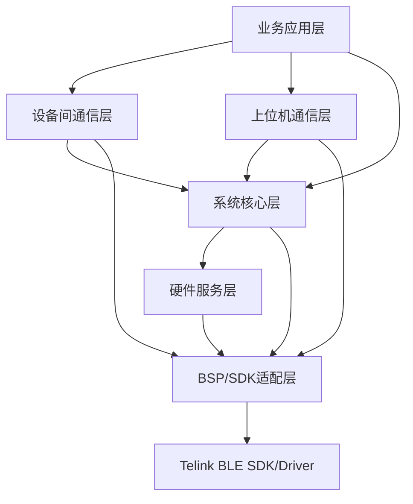
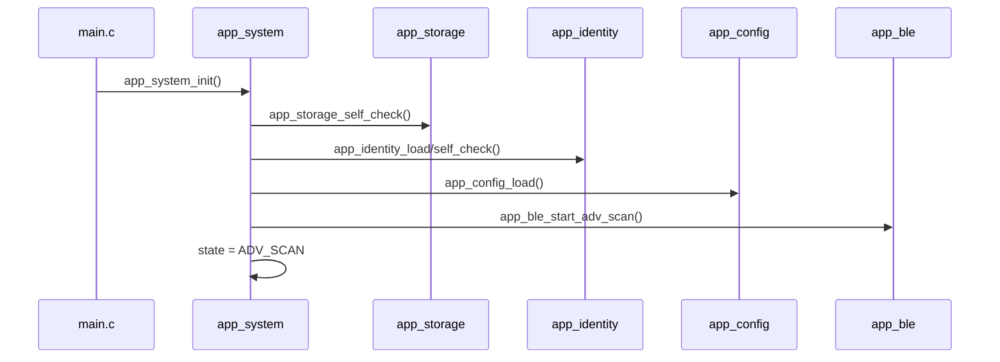
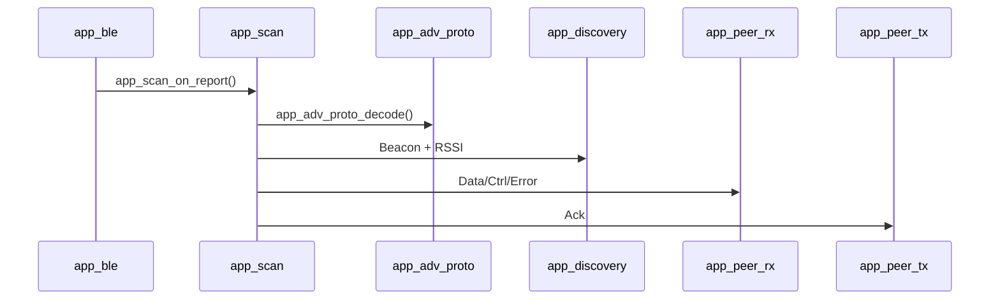
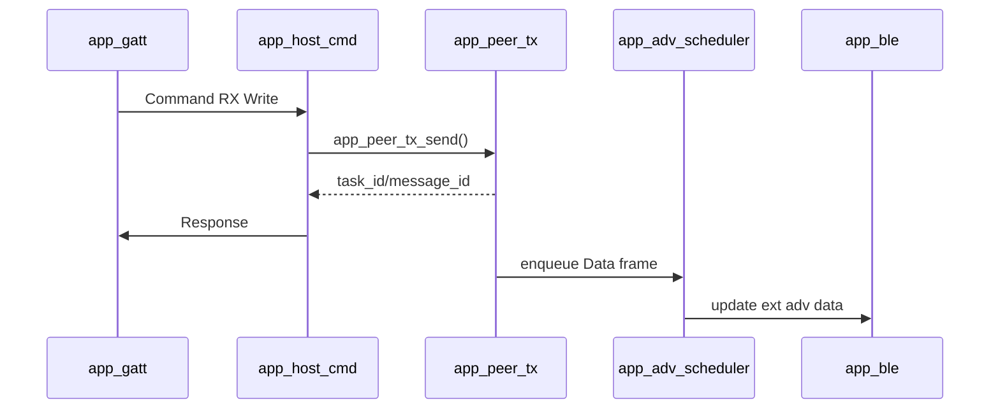
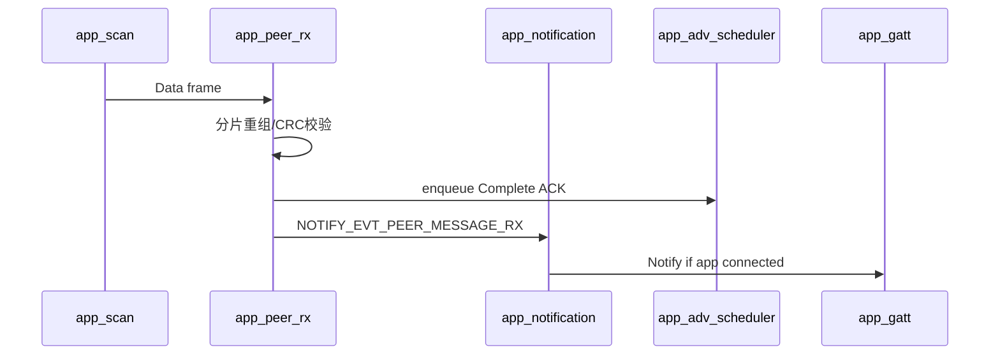
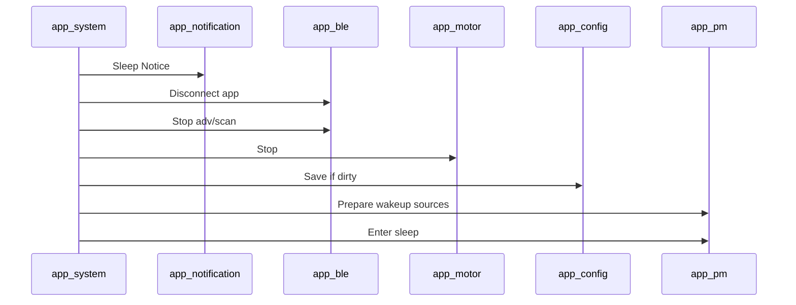

# 蓝牙吊坠下位机软件架构设计

## 1. 文档目的

本文档定义蓝牙吊坠下位机固件的软件架构。

本文档基于以下设计文档：

- `doc/蓝牙吊坠系统需求说明.md`
- `doc/蓝牙吊坠状态机设计.md`
- `doc/蓝牙吊坠扩展广播设备间通信协议.md`
- `doc/蓝牙吊坠上位机功能与指令协议.md`

本文档重点定义：

- 下位机软件分层。
- 下位机软件模块。
- 各模块职责。
- 各模块之间的接口函数。
- 主要业务流程中的模块调用关系。

## 2. 当前工程基础

当前工程为 Telink B85/TLSR8258 BLE SDK 工程。

当前业务入口主要位于：

- `tc_ble_single_sdk/vendor/ble_sample/main.c`
- `tc_ble_single_sdk/vendor/ble_sample/app.c`
- `tc_ble_single_sdk/vendor/ble_sample/app_att.c`
- `tc_ble_single_sdk/vendor/ble_sample/app_config.h`

当前已有能力：

- BLE 初始化。
- 扩展广播初始化。
- 扫描初始化。
- 扫描报告解析。
- 手机连接和断开回调。
- 示例 GATT 表。
- 简单 250ms 周期任务。
- 简单 deep sleep 逻辑。

后续架构目标不是一次性重写 SDK 示例，而是逐步把业务逻辑从 `main.c/app.c/app_att.c` 中拆到独立模块。

## 3. 架构原则

下位机软件遵循以下原则：

- BLE 回调中只做轻量解析和事件投递，不做复杂业务逻辑。
- 所有系统状态跳转集中在状态机模块。
- 设备间广播协议独立于 BLE SDK 调用层。
- 手机 GATT 命令协议独立于产品业务模块。
- Flash 写入、马达控制、广播发送重试等耗时动作在主循环或软件定时器中处理。
- 每个硬件外设有独立驱动适配模块，业务模块不直接操作 GPIO/I2C/ADC。
- 每个跨模块数据结构由一个模块拥有，其他模块通过接口访问。

## 4. 软件分层



分层说明：

| 层级 | 作用 | 典型模块 |
| --- | --- | --- |
| 业务应用层 | 产品业务编排 | `app_product`、`app_notification` |
| 设备间通信层 | 扩展广播协议、发现、消息收发 | `app_adv_proto`、`app_peer_tx`、`app_peer_rx`、`app_discovery` |
| 上位机通信层 | GATT 服务、Host Frame、命令处理 | `app_gatt`、`app_host_cmd` |
| 系统核心层 | 状态机、事件队列、配置、存储、身份、安全 | `app_system`、`app_event`、`app_config_store`、`app_identity` |
| 硬件服务层 | 电池、充电、动作检测、马达、低功耗 | `app_battery`、`app_charge`、`app_motion`、`app_motor`、`app_pm` |
| BSP/SDK 适配层 | 隔离 Telink SDK 和板级引脚 | `app_board`、`app_ble`、`app_storage`、`app_crypto` |

## 5. 推荐目录结构

建议在当前示例工程下新增产品模块目录：

```text
tc_ble_single_sdk/vendor/ble_sample/
  main.c
  app.c
  app_att.c
  app_config.h
  pendant/
    app_types.h
    app_board.h
    app_board.c
    app_event.h
    app_event.c
    app_system.h
    app_system.c
    app_config_store.h
    app_config_store.c
    app_storage.h
    app_storage.c
    app_identity.h
    app_identity.c
    app_crypto.h
    app_crypto.c
    app_ble.h
    app_ble.c
    app_gatt.h
    app_gatt.c
    app_host_cmd.h
    app_host_cmd.c
    app_adv_proto.h
    app_adv_proto.c
    app_peer_table.h
    app_peer_table.c
    app_discovery.h
    app_discovery.c
    app_peer_tx.h
    app_peer_tx.c
    app_peer_rx.h
    app_peer_rx.c
    app_notification.h
    app_notification.c
    app_battery.h
    app_battery.c
    app_charge.h
    app_charge.c
    app_motion.h
    app_motion.c
    app_motor.h
    app_motor.c
    app_pm.h
    app_pm.c
    app_diag.h
    app_diag.c
    app_factory.h
    app_factory.c
```

说明：

- 初期可以先保留 `app.c` 中的 BLE 初始化，新增模块只接管业务逻辑。
- 后续再将 BLE 初始化和回调注册迁移到 `app_ble.c`。
- 新增 `.c` 文件后，需要同步更新 Telink 工程的 `subdir.mk` 或重新由 IDE 生成工程文件。

## 6. 公共类型模块

### 6.1 模块名称

- `app_types.h`

### 6.2 职责

定义跨模块公共类型、常量、错误码、状态码和协议基础结构。

### 6.3 关键类型

```c
typedef enum {
    APP_OK = 0,
    APP_ERR_PARAM = 1,
    APP_ERR_STATE = 2,
    APP_ERR_BUSY = 3,
    APP_ERR_NO_MEM = 4,
    APP_ERR_TIMEOUT = 5,
    APP_ERR_CRC = 6,
    APP_ERR_FLASH = 7,
    APP_ERR_UNSUPPORTED = 8,
    APP_ERR_PERMISSION = 9,
} app_status_t;

typedef enum {
    SYS_STATE_BOOT = 0,
    SYS_STATE_SELF_CHECK,
    SYS_STATE_ADV_SCAN,
    SYS_STATE_APP_CONNECTED,
    SYS_STATE_SLEEP_PREPARE,
    SYS_STATE_SLEEP,
    SYS_STATE_ERROR,
} app_system_state_t;

typedef enum {
    PEER_LEVEL_NONE = 0,
    PEER_LEVEL_S1 = 1,
    PEER_LEVEL_S2 = 2,
    PEER_LEVEL_S3 = 3,
    PEER_LEVEL_LOST = 4,
} app_peer_level_t;

typedef struct {
    u8 bytes[16];
} app_eid_t;

typedef struct {
    u8 bytes[16];
} app_unique_id_t;
```

## 7. BSP 板级配置模块

### 7.1 模块名称

- `app_board.h`
- `app_board.c`

### 7.2 职责

统一管理硬件版本、GPIO 分配、外设初始化顺序和板级能力。

业务模块不得直接写死 GPIO 引脚，应通过 `app_board` 获取。

### 7.3 主要接口

```c
typedef enum {
    APP_HW_REV_UNKNOWN = 0,
    APP_HW_REV_OLD = 1,
    APP_HW_REV_NEW = 2,
} app_hw_rev_t;

typedef enum {
    APP_PIN_BAT_ADC = 0,
    APP_PIN_MOTION,
    APP_PIN_CHARGE_DET,
    APP_PIN_MOTOR_TRIG,
    APP_PIN_MOTOR_I2C_SDA,
    APP_PIN_MOTOR_I2C_SCL,
    APP_PIN_UART_TX,
    APP_PIN_UART_RX,
    APP_PIN_UART_RTS,
    APP_PIN_UART_CTS,
} app_board_pin_id_t;

typedef struct {
    app_hw_rev_t hw_rev;
    u8 has_charge_detect;
    u8 has_uart_flow_control;
    u8 has_motor_driver;
} app_board_info_t;

void app_board_init(void);
const app_board_info_t *app_board_get_info(void);
u32 app_board_get_pin(app_board_pin_id_t pin_id);
app_status_t app_board_self_check(void);
```

### 7.4 被调用关系

- `main.c` 启动后调用 `app_board_init()`。
- `app_battery`、`app_charge`、`app_motion`、`app_motor` 通过 `app_board_get_pin()` 获取引脚。
- `app_system` 自检阶段调用 `app_board_self_check()`。

## 8. 事件队列模块

### 8.1 模块名称

- `app_event.h`
- `app_event.c`

### 8.2 职责

提供模块间异步事件队列。

BLE 回调、GPIO 事件、定时器事件、GATT 写入事件都先进入事件队列，再由主循环统一处理。

### 8.3 主要接口

```c
typedef enum {
    APP_EVT_BOOT_DONE = 0,
    APP_EVT_SELF_CHECK_OK,
    APP_EVT_SELF_CHECK_FAIL,
    APP_EVT_APP_CONNECTED,
    APP_EVT_APP_DISCONNECTED,
    APP_EVT_APP_COMMAND_RX,
    APP_EVT_APP_IDLE_TIMEOUT,
    APP_EVT_ADV_REPORT_RX,
    APP_EVT_PEER_FOUND,
    APP_EVT_PEER_LEVEL_CHANGED,
    APP_EVT_PEER_MESSAGE_RX,
    APP_EVT_PEER_MESSAGE_TX_DONE,
    APP_EVT_IDLE_TIMEOUT,
    APP_EVT_MOTION_DETECTED,
    APP_EVT_CHARGE_STARTED,
    APP_EVT_CHARGE_STOPPED,
    APP_EVT_BATTERY_LOW,
    APP_EVT_BATTERY_CRITICAL,
    APP_EVT_FATAL_ERROR,
    APP_EVT_SLEEP_READY,
} app_event_id_t;

typedef struct {
    app_event_id_t id;
    u16 len;
    u8 data[32];
} app_event_t;

void app_event_init(void);
app_status_t app_event_post(app_event_id_t id, const void *data, u16 len);
app_status_t app_event_fetch(app_event_t *event);
u8 app_event_pending_count(void);
```

### 8.4 设计约束

- 事件 payload 不应过大。
- 大块数据应放在专属缓存中，事件只携带索引或 ID。
- 队列满时应记录诊断错误，不应阻塞 BLE 回调。

## 9. 系统状态机模块

### 9.1 模块名称

- `app_system.h`
- `app_system.c`

### 9.2 职责

管理下位机系统主状态和状态跳转。

该模块是所有状态切换的唯一入口。

### 9.3 主要接口

```c
typedef struct {
    app_system_state_t state;
    app_system_state_t previous_state;
    u16 error_code;
    u8 wakeup_reason;
    u32 uptime_s;
} app_system_snapshot_t;

void app_system_init(void);
void app_system_poll(void);
void app_system_handle_event(const app_event_t *event);

app_system_state_t app_system_get_state(void);
void app_system_get_snapshot(app_system_snapshot_t *snapshot);

app_status_t app_system_request_sleep(u8 reason);
app_status_t app_system_report_error(u16 error_code, u16 detail);
```

### 9.4 调用关系

- `main.c` 主循环周期调用 `app_system_poll()`。
- `app_event` 拉取到事件后交给 `app_system_handle_event()`。
- `app_gatt` 读取系统状态时调用 `app_system_get_snapshot()`。
- `app_pm` 只执行低功耗动作，不直接改变系统状态。

## 10. 配置管理模块

### 10.1 模块名称

- `app_config_store.h`
- `app_config_store.c`

### 10.2 职责

管理运行配置、默认配置、参数校验和 Flash 持久化。

### 10.3 配置结构

```c
typedef struct {
    u8 version;
    s8 rssi_t1;
    s8 rssi_t2;
    s8 rssi_t3;
    u16 tin_ms;
    u16 tout_ms;
    u16 idle_sleep_s;
    u16 app_idle_s;
    u16 adv_interval_ms;
    u16 scan_interval_ms;
    u16 scan_window_ms;
    u8 vibration_enable;
    u8 reliable_msg_default;
    u8 privacy_mode;
    u16 crc16;
} app_runtime_config_t;
```

### 10.4 主要接口

```c
void app_config_init(void);
const app_runtime_config_t *app_config_get(void);
app_status_t app_config_set(const app_runtime_config_t *config);
app_status_t app_config_validate(const app_runtime_config_t *config);
app_status_t app_config_load(void);
app_status_t app_config_save(void);
app_status_t app_config_reset_default(void);
```

### 10.5 被调用关系

- `app_system` 自检阶段调用 `app_config_load()`。
- `app_discovery` 获取 RSSI 阈值和 Tin/Tout。
- `app_ble` 获取广播和扫描参数。
- `app_host_cmd` 处理 `GET_CONFIG`、`SET_CONFIG`、`SAVE_CONFIG`。

## 11. Flash 存储模块

### 11.1 模块名称

- `app_storage.h`
- `app_storage.c`

### 11.2 职责

封装 Flash 读写、擦除、分区、CRC 和写入保护策略。

### 11.3 分区建议

| 分区 | 内容 |
| --- | --- |
| Identity | 唯一识别码、写入标志、校验 |
| Config | 用户配置 |
| Bond | 手机绑定信息 |
| Event Log | 离线事件摘要 |
| Factory | 量产测试标志 |

实际地址必须避开 SDK 已有 MAC、校准、pairing、OTA 区域。

### 11.4 主要接口

```c
typedef enum {
    APP_STORAGE_PART_IDENTITY = 0,
    APP_STORAGE_PART_CONFIG,
    APP_STORAGE_PART_BOND,
    APP_STORAGE_PART_EVENT_LOG,
    APP_STORAGE_PART_FACTORY,
} app_storage_part_t;

void app_storage_init(void);
app_status_t app_storage_self_check(void);
app_status_t app_storage_read(app_storage_part_t part, u32 offset, void *buf, u16 len);
app_status_t app_storage_write(app_storage_part_t part, u32 offset, const void *buf, u16 len);
app_status_t app_storage_erase(app_storage_part_t part);
u32 app_storage_get_part_addr(app_storage_part_t part);
u32 app_storage_get_part_size(app_storage_part_t part);
```

## 12. 身份与 EID 模块

### 12.1 模块名称

- `app_identity.h`
- `app_identity.c`

### 12.2 职责

管理唯一识别码、广播 EID、短 ID 和身份校验。

### 12.3 主要接口

```c
typedef struct {
    app_unique_id_t unique_id;
    app_eid_t current_eid;
    u32 short_id;
    u8 key_id;
    u8 privacy_mode;
} app_identity_info_t;

void app_identity_init(void);
app_status_t app_identity_load(void);
app_status_t app_identity_self_check(void);
app_status_t app_identity_update_eid(u32 epoch);

const app_identity_info_t *app_identity_get_info(void);
const app_eid_t *app_identity_get_eid(void);
u32 app_identity_get_short_id(void);
u8 app_identity_get_key_id(void);
```

### 12.4 被调用关系

- `app_system` 自检阶段调用 `app_identity_load()` 和 `app_identity_self_check()`。
- `app_adv_proto` 构建广播帧时读取当前 EID。
- `app_gatt` 读取设备信息时返回 EID 和短 ID。

## 13. 加密与校验模块

### 13.1 模块名称

- `app_crypto.h`
- `app_crypto.c`

### 13.2 职责

封装 AES、CRC8、CRC16、CRC32、CMAC 或 MIC 计算。

业务模块不直接依赖具体算法实现。

### 13.3 主要接口

```c
void app_crypto_init(void);

u8 app_crc8(const void *data, u16 len);
u16 app_crc16(const void *data, u16 len);
u32 app_crc32(const void *data, u16 len, u32 init);

app_status_t app_crypto_aes128_encrypt(const u8 key[16],
                                       const u8 input[16],
                                       u8 output[16]);

app_status_t app_crypto_cmac(const u8 key[16],
                             const void *data,
                             u16 len,
                             u8 *mic,
                             u8 mic_len);
```

## 14. BLE SDK 适配模块

### 14.1 模块名称

- `app_ble.h`
- `app_ble.c`

### 14.2 职责

封装 Telink BLE 初始化、广播设置、扫描设置、连接回调和 GATT 初始化入口。

其他业务模块不直接调用 Telink BLE 初始化接口。

### 14.3 主要接口

```c
typedef struct {
    u16 adv_interval_ms;
    u16 scan_interval_ms;
    u16 scan_window_ms;
    u8 tx_power;
} app_ble_params_t;

typedef struct {
    u8 connected;
    u8 peer_addr[6];
    u16 conn_handle;
} app_ble_conn_info_t;

void app_ble_init(void);
app_status_t app_ble_start_adv_scan(const app_ble_params_t *params);
app_status_t app_ble_stop_adv_scan(void);
app_status_t app_ble_update_ext_adv_data(const u8 *data, u8 len);
app_status_t app_ble_disconnect_app(u8 reason);

u8 app_ble_is_app_connected(void);
void app_ble_get_conn_info(app_ble_conn_info_t *info);
void app_ble_poll(void);
```

### 14.4 回调入口

Telink 回调中应只转换为事件：

```c
void app_ble_on_connected(const u8 *peer_addr, u16 conn_handle);
void app_ble_on_disconnected(u8 reason);
void app_ble_on_adv_report(const u8 *adv_data, u8 adv_len, s8 rssi, const u8 *addr);
```

## 15. GATT 服务模块

### 15.1 模块名称

- `app_gatt.h`
- `app_gatt.c`

### 15.2 职责

定义产品专用 GATT 服务和特征。

处理 GATT Read、Write、Notify 的底层适配。

### 15.3 主要接口

```c
void app_gatt_init(void);

app_status_t app_gatt_notify_command_tx(const u8 *data, u16 len);
app_status_t app_gatt_notify_device_state(void);
app_status_t app_gatt_notify_event(const u8 *event_data, u16 len);

int app_gatt_on_command_rx_write(void *p);
int app_gatt_on_config_write(void *p);
int app_gatt_on_device_info_read(void *p);
int app_gatt_on_device_state_read(void *p);
```

### 15.4 被调用关系

- `app_ble_init()` 中调用 `app_gatt_init()`。
- `app_host_cmd` 响应命令时调用 `app_gatt_notify_command_tx()`。
- `app_notification` 上报事件时调用 `app_gatt_notify_event()`。

## 16. 上下位机命令模块

### 16.1 模块名称

- `app_host_cmd.h`
- `app_host_cmd.c`

### 16.2 职责

解析 Host Frame，分发上位机命令，编码 Response/Event。

### 16.3 主要接口

```c
typedef enum {
    HOST_FRAME_REQUEST = 1,
    HOST_FRAME_RESPONSE = 2,
    HOST_FRAME_EVENT = 3,
} app_host_frame_type_t;

typedef struct {
    app_host_frame_type_t type;
    u8 flags;
    u16 seq;
    u16 cmd_id;
    u16 payload_len;
    const u8 *payload;
} app_host_frame_t;

void app_host_cmd_init(void);
app_status_t app_host_cmd_on_rx(const u8 *data, u16 len);
app_status_t app_host_cmd_send_response(u16 seq, u16 cmd_id, u8 status, u16 error_code, const u8 *data, u16 len);
app_status_t app_host_cmd_send_event(u16 event_id, const u8 *data, u16 len);
void app_host_cmd_poll(void);
```

### 16.4 命令分发关系

| 命令类型 | 调用模块 |
| --- | --- |
| 设备信息 | `app_identity`、`app_system` |
| 配置读写 | `app_config_store` |
| 附近设备列表 | `app_peer_table` |
| 发送消息 | `app_peer_tx` |
| 取消消息 | `app_peer_tx` |
| 电池/充电 | `app_battery`、`app_charge` |
| 马达测试 | `app_motor` |
| 休眠/重启 | `app_system`、`app_pm` |
| 调试日志 | `app_diag` |

## 17. 扩展广播协议模块

### 17.1 模块名称

- `app_adv_proto.h`
- `app_adv_proto.c`

### 17.2 职责

实现 `PENDANT-ADV` 帧的编码、解码、CRC 校验和基础字段处理。

该模块只负责协议帧，不负责发送队列和接收重组。

### 17.3 主要接口

```c
typedef enum {
    ADV_FRAME_BEACON = 0x01,
    ADV_FRAME_DATA = 0x10,
    ADV_FRAME_ACK = 0x11,
    ADV_FRAME_CTRL = 0x12,
    ADV_FRAME_ERROR = 0x13,
} app_adv_frame_type_t;

typedef struct {
    app_adv_frame_type_t type;
    u8 flags;
    u8 key_id;
    u8 device_state;
    u16 frame_seq;
    app_eid_t src_eid;
    app_eid_t dst_eid;
    u32 message_id;
    u8 fragment_index;
    u8 fragment_count;
    const u8 *payload;
    u8 payload_len;
} app_adv_frame_t;

void app_adv_proto_init(void);
app_status_t app_adv_proto_encode(const app_adv_frame_t *frame, u8 *out, u8 out_max, u8 *out_len);
app_status_t app_adv_proto_decode(const u8 *data, u8 len, app_adv_frame_t *frame);
u8 app_adv_proto_is_manufacturer_payload(const u8 *ad_data, u8 ad_len, const u8 **payload, u8 *payload_len);
```

## 18. 广播帧调度模块

### 18.1 模块名称

- `app_adv_scheduler.h`
- `app_adv_scheduler.c`

### 18.2 职责

决定当前扩展广播应该发送 Beacon、Data、Ack、Ctrl 还是 Error。

由于当前工程只配置 1 个扩展广播集，本模块负责复用同一个广播集。

### 18.3 主要接口

```c
void app_adv_scheduler_init(void);
void app_adv_scheduler_poll(void);

app_status_t app_adv_scheduler_request_beacon_update(void);
app_status_t app_adv_scheduler_enqueue_frame(const app_adv_frame_t *frame);
app_status_t app_adv_scheduler_build_next_adv_data(u8 *buf, u8 max_len, u8 *out_len);
```

### 18.4 被调用关系

- `main.c` 或 `app_system_poll()` 周期调用 `app_adv_scheduler_poll()`。
- `app_peer_tx` 将 Data 帧加入调度器。
- `app_peer_rx` 将 Ack 帧加入调度器。
- `app_ble_update_ext_adv_data()` 由本模块触发。

## 19. 附近设备表模块

### 19.1 模块名称

- `app_peer_table.h`
- `app_peer_table.c`

### 19.2 职责

维护附近设备记录、RSSI、发现等级、最后出现时间、能力位和状态。

### 19.3 主要接口

```c
#define APP_PEER_MAX_COUNT 32

typedef struct {
    app_eid_t eid;
    u32 short_id;
    app_peer_level_t level;
    s8 rssi;
    s8 rssi_avg;
    u32 first_seen_tick;
    u32 last_seen_tick;
    u16 capability_flags;
    u8 flags;
} app_peer_record_t;

void app_peer_table_init(void);
void app_peer_table_clear(void);

app_peer_record_t *app_peer_table_find(const app_eid_t *eid);
app_peer_record_t *app_peer_table_find_or_alloc(const app_eid_t *eid);
app_status_t app_peer_table_remove(const app_eid_t *eid);

u8 app_peer_table_count(void);
u8 app_peer_table_copy(app_peer_record_t *out, u8 max_count);
void app_peer_table_poll_timeout(u32 now_tick);
```

### 19.4 被调用关系

- `app_discovery` 更新发现等级。
- `app_peer_rx` 刷新最后出现时间。
- `app_host_cmd` 处理 `GET_PEER_LIST` 时读取。

## 20. RSSI 发现算法模块

### 20.1 模块名称

- `app_discovery.h`
- `app_discovery.c`

### 20.2 职责

根据 Beacon RSSI、Tin、Tout、T1/T2/T3 判断对端设备进入或退出 S1/S2/S3。

### 20.3 主要接口

```c
typedef struct {
    app_eid_t peer_eid;
    app_peer_level_t old_level;
    app_peer_level_t new_level;
    s8 rssi_avg;
    u8 reason;
} app_discovery_event_t;

void app_discovery_init(void);
void app_discovery_on_beacon(const app_eid_t *eid, s8 rssi, u32 now_tick);
void app_discovery_poll(u32 now_tick);
void app_discovery_reset_peer(const app_eid_t *eid);
```

### 20.4 输出事件

发现等级变化时，模块投递：

- `APP_EVT_PEER_FOUND`
- `APP_EVT_PEER_LEVEL_CHANGED`

同时通知：

- `app_motor` 排队振动。
- `app_notification` 上报手机。

## 21. 设备间发送模块

### 21.1 模块名称

- `app_peer_tx.h`
- `app_peer_tx.c`

### 21.2 职责

管理设备间消息发送任务，包括分片、重发、等待 ACK、超时和进度通知。

### 21.3 主要接口

```c
typedef enum {
    PEER_TX_IDLE = 0,
    PEER_TX_SENDING,
    PEER_TX_WAIT_ACK,
    PEER_TX_DONE,
    PEER_TX_FAILED,
} app_peer_tx_state_t;

typedef struct {
    u8 task_id;
    u32 message_id;
    app_eid_t dst_eid;
    app_peer_tx_state_t state;
    u8 fragment_count;
    u32 sent_bitmap;
    u32 ack_bitmap;
    u8 retry_count;
} app_peer_tx_status_t;

void app_peer_tx_init(void);
app_status_t app_peer_tx_send(const app_eid_t *dst_eid,
                              u8 app_msg_type,
                              const u8 *payload,
                              u16 payload_len,
                              u8 reliable,
                              u8 *task_id,
                              u32 *message_id);

app_status_t app_peer_tx_cancel(u8 task_id);
app_status_t app_peer_tx_get_status(u8 task_id, app_peer_tx_status_t *status);
void app_peer_tx_on_ack(const app_adv_frame_t *ack_frame);
void app_peer_tx_poll(u32 now_tick);
```

### 21.4 被调用关系

- `app_host_cmd` 处理 `SEND_PEER_MESSAGE` 时调用 `app_peer_tx_send()`。
- `app_peer_rx` 收到 Ack 后调用 `app_peer_tx_on_ack()`。
- `app_adv_scheduler` 从发送任务中取待广播 Data 帧。

## 22. 设备间接收模块

### 22.1 模块名称

- `app_peer_rx.h`
- `app_peer_rx.c`

### 22.2 职责

管理设备间消息接收任务，包括分片缓存、重组、CRC 校验、去重和 ACK 生成。

### 22.3 主要接口

```c
typedef struct {
    app_eid_t src_eid;
    u32 message_id;
    u8 app_msg_type;
    u16 payload_len;
    const u8 *payload;
} app_peer_message_t;

void app_peer_rx_init(void);
app_status_t app_peer_rx_on_data(const app_adv_frame_t *data_frame, s8 rssi);
app_status_t app_peer_rx_on_ctrl(const app_adv_frame_t *ctrl_frame);
void app_peer_rx_poll(u32 now_tick);
```

### 22.4 输出事件

完整消息接收成功后投递：

- `APP_EVT_PEER_MESSAGE_RX`

同时调用：

- `app_notification` 缓存并通知手机。
- `app_adv_scheduler` 排队 Complete ACK。

## 23. 扫描报告处理模块

### 23.1 模块名称

- `app_scan.h`
- `app_scan.c`

### 23.2 职责

将 BLE 扫描报告解析为协议帧，并分发给发现、接收和发送模块。

### 23.3 主要接口

```c
typedef struct {
    u8 addr[6];
    s8 rssi;
    const u8 *adv_data;
    u8 adv_len;
} app_scan_report_t;

void app_scan_init(void);
void app_scan_on_report(const app_scan_report_t *report);
void app_scan_poll(void);
```

### 23.4 分发规则

| 帧类型 | 分发目标 |
| --- | --- |
| Beacon | `app_discovery`、`app_peer_table` |
| Data | `app_peer_rx`、`app_peer_table` |
| Ack | `app_peer_tx`、`app_peer_table` |
| Ctrl | `app_peer_rx` 或 `app_peer_tx` |
| Error | `app_peer_table`、`app_notification` |

## 24. 通知与离线事件模块

### 24.1 模块名称

- `app_notification.h`
- `app_notification.c`

### 24.2 职责

统一管理需要通知手机的事件。

如果手机已连接，立即通过 GATT Notify 上报。

如果手机未连接，将关键事件写入内存队列或 Flash 离线事件区。

### 24.3 主要接口

```c
typedef enum {
    NOTIFY_EVT_DEVICE_STATE_CHANGED = 0x8001,
    NOTIFY_EVT_BATTERY_CHANGED = 0x8002,
    NOTIFY_EVT_CHARGE_CHANGED = 0x8003,
    NOTIFY_EVT_PEER_FOUND = 0x8004,
    NOTIFY_EVT_PEER_LEVEL_CHANGED = 0x8005,
    NOTIFY_EVT_PEER_LOST = 0x8006,
    NOTIFY_EVT_PEER_MESSAGE_RX = 0x8007,
    NOTIFY_EVT_PEER_MESSAGE_TX_PROGRESS = 0x8008,
    NOTIFY_EVT_PEER_MESSAGE_TX_DONE = 0x8009,
    NOTIFY_EVT_ERROR = 0x800A,
    NOTIFY_EVT_SLEEP_NOTICE = 0x800B,
} app_notify_event_id_t;

void app_notification_init(void);
app_status_t app_notification_push(app_notify_event_id_t id, const void *payload, u16 len);
app_status_t app_notification_flush_to_host(void);
u8 app_notification_pending_count(void);
void app_notification_poll(void);
```

## 25. 电池检测模块

### 25.1 模块名称

- `app_battery.h`
- `app_battery.c`

### 25.2 职责

采集电池 ADC，计算电池电压、电量等级和低电事件。

### 25.3 主要接口

```c
typedef struct {
    u16 voltage_mv;
    u8 percent;
    u8 low;
    u8 critical;
} app_battery_state_t;

void app_battery_init(void);
app_status_t app_battery_sample(void);
void app_battery_poll(u32 now_tick);
void app_battery_get_state(app_battery_state_t *state);
```

### 25.4 输出事件

- `APP_EVT_BATTERY_LOW`
- `APP_EVT_BATTERY_CRITICAL`
- `NOTIFY_EVT_BATTERY_CHANGED`

## 26. 充电检测模块

### 26.1 模块名称

- `app_charge.h`
- `app_charge.c`

### 26.2 职责

检测充电开始和充电结束，并进行消抖。

### 26.3 主要接口

```c
typedef enum {
    CHARGE_STATE_UNKNOWN = 0,
    CHARGE_STATE_NOT_CHARGING = 1,
    CHARGE_STATE_CHARGING = 2,
    CHARGE_STATE_FULL = 3,
} app_charge_state_t;

void app_charge_init(void);
void app_charge_poll(u32 now_tick);
app_charge_state_t app_charge_get_state(void);
u8 app_charge_is_charging(void);
```

### 26.4 输出事件

- `APP_EVT_CHARGE_STARTED`
- `APP_EVT_CHARGE_STOPPED`
- `NOTIFY_EVT_CHARGE_CHANGED`

## 27. 动作检测模块

### 27.1 模块名称

- `app_motion.h`
- `app_motion.c`

### 27.2 职责

检测振动开关电平变化，产生动作事件，并为低功耗唤醒配置提供引脚信息。

### 27.3 主要接口

```c
typedef struct {
    u32 motion_count;
    u32 last_motion_tick;
    u8 current_level;
} app_motion_state_t;

void app_motion_init(void);
void app_motion_poll(u32 now_tick);
void app_motion_on_gpio_edge(void);
void app_motion_get_state(app_motion_state_t *state);
u32 app_motion_get_wakeup_pin(void);
```

### 27.4 输出事件

- `APP_EVT_MOTION_DETECTED`

## 28. 马达控制模块

### 28.1 模块名称

- `app_motor.h`
- `app_motor.c`

### 28.2 职责

封装 DRV2625 初始化、触发和振动队列。

业务模块只提交振动模式，不直接操作 I2C 或 TRIG 引脚。

### 28.3 主要接口

```c
typedef enum {
    MOTOR_PATTERN_NONE = 0,
    MOTOR_PATTERN_ONE,
    MOTOR_PATTERN_TWO,
    MOTOR_PATTERN_THREE,
    MOTOR_PATTERN_ERROR,
    MOTOR_PATTERN_CUSTOM,
} app_motor_pattern_t;

void app_motor_init(void);
app_status_t app_motor_self_check(void);
app_status_t app_motor_play(app_motor_pattern_t pattern);
app_status_t app_motor_stop(void);
void app_motor_poll(u32 now_tick);
u8 app_motor_is_busy(void);
```

### 28.4 被调用关系

- `app_discovery` 在 S1/S2/S3 变化时调用 `app_motor_play()`。
- `app_host_cmd` 处理 `MOTOR_TEST` 时调用 `app_motor_play()`。
- `app_system` 进入休眠准备时调用 `app_motor_stop()`。

## 29. 低功耗模块

### 29.1 模块名称

- `app_pm.h`
- `app_pm.c`

### 29.2 职责

管理休眠准备、唤醒源配置和进入低功耗模式。

状态跳转仍由 `app_system` 负责，`app_pm` 只执行具体低功耗动作。

### 29.3 主要接口

```c
typedef enum {
    PM_SLEEP_REASON_IDLE = 1,
    PM_SLEEP_REASON_CHARGE = 2,
    PM_SLEEP_REASON_APP_IDLE = 3,
    PM_SLEEP_REASON_BATTERY_CRITICAL = 4,
    PM_SLEEP_REASON_ERROR = 5,
} app_sleep_reason_t;

typedef enum {
    PM_WAKEUP_REASON_UNKNOWN = 0,
    PM_WAKEUP_REASON_MOTION = 1,
    PM_WAKEUP_REASON_CHARGE_STOPPED = 2,
    PM_WAKEUP_REASON_RESET = 3,
} app_wakeup_reason_t;

void app_pm_init(void);
app_wakeup_reason_t app_pm_get_wakeup_reason(void);
app_status_t app_pm_prepare_sleep(app_sleep_reason_t reason);
void app_pm_enter_sleep(void);
void app_pm_poll(u32 now_tick);
```

### 29.4 休眠准备调用关系

`app_system` 进入 `SYS_STATE_SLEEP_PREPARE` 后按顺序调用：

1. `app_notification_push(NOTIFY_EVT_SLEEP_NOTICE, ...)`
2. `app_ble_disconnect_app(...)`
3. `app_ble_stop_adv_scan()`
4. `app_peer_tx_cancel(...)`
5. `app_motor_stop()`
6. `app_config_save()`，仅当配置 dirty。
7. `app_pm_prepare_sleep(reason)`
8. `app_pm_enter_sleep()`

## 30. 诊断与错误模块

### 30.1 模块名称

- `app_diag.h`
- `app_diag.c`

### 30.2 职责

统一管理错误码、调试日志、运行统计和断言。

### 30.3 主要接口

```c
typedef struct {
    u16 error_code;
    u16 detail;
    app_system_state_t state;
    u32 tick;
} app_error_record_t;

void app_diag_init(void);
void app_diag_log_error(u16 error_code, u16 detail);
void app_diag_log_info(const char *tag, const char *msg);
void app_diag_get_last_error(app_error_record_t *record);
void app_diag_clear_error(void);
u8 app_diag_has_error(void);
```

## 31. 工厂与量产模块

### 31.1 模块名称

- `app_factory.h`
- `app_factory.c`

### 31.2 职责

提供量产测试、唯一识别码写入校验、马达测试、电池测试、充电测试和广播测试接口。

量产命令必须受权限控制，量产固件和正式固件可通过编译宏区分。

### 31.3 主要接口

```c
void app_factory_init(void);
app_status_t app_factory_write_unique_id(const app_unique_id_t *id);
app_status_t app_factory_read_unique_id(app_unique_id_t *id);
app_status_t app_factory_run_self_test(u32 test_mask, u32 *result_mask);
app_status_t app_factory_lock_identity(void);
u8 app_factory_is_locked(void);
```

## 32. 主循环架构

建议 `main.c` 主循环最终收敛为：

```c
int main(void)
{
    platform_init();
    app_board_init();
    app_event_init();
    app_diag_init();
    app_storage_init();
    app_config_init();
    app_identity_init();
    app_crypto_init();
    app_battery_init();
    app_charge_init();
    app_motion_init();
    app_motor_init();
    app_ble_init();
    app_system_init();

    irq_enable();

    while (1) {
        blt_sdk_main_loop();

        app_ble_poll();
        app_system_poll();
        app_scan_poll();
        app_discovery_poll(clock_time());
        app_peer_rx_poll(clock_time());
        app_peer_tx_poll(clock_time());
        app_adv_scheduler_poll();
        app_host_cmd_poll();
        app_notification_poll();
        app_battery_poll(clock_time());
        app_charge_poll(clock_time());
        app_motion_poll(clock_time());
        app_motor_poll(clock_time());
        app_pm_poll(clock_time());
    }
}
```

说明：

- `platform_init()` 代表现有 Telink 示例中的时钟、RF、GPIO、UART 等基础初始化。
- 初期可以不一次性改成上述结构，可先逐个模块接入。
- `clock_time()` 是否直接传入各模块，后续可由 `app_time` 模块封装。

## 33. 关键业务流程

### 33.1 启动流程



### 33.2 扫描接收流程



### 33.3 手机发送消息流程



### 33.4 收到完整设备间消息流程



### 33.5 休眠流程



## 34. 模块依赖约束

为避免后续实现中出现循环依赖，建议遵守以下规则：

- `app_system` 可以调用大部分服务模块，但服务模块不应直接修改 `app_system` 状态。
- `app_peer_tx` 和 `app_peer_rx` 不直接调用 GATT，通过 `app_notification` 上报。
- `app_gatt` 不直接处理业务，只把命令交给 `app_host_cmd`。
- `app_host_cmd` 可以调用业务模块，但不直接操作 BLE 广播。
- `app_discovery` 不直接操作 GATT，只通过 `app_notification` 上报。
- `app_motor` 不知道 S1/S2/S3，只接受振动模式。
- `app_storage` 不知道配置结构和身份结构，只提供分区读写。
- `app_crypto` 不保存业务 key，key 由 `app_identity` 或后续 key 模块管理。

## 35. 第一阶段实现建议

第一阶段建议优先实现以下模块：

1. `app_types`
2. `app_board`
3. `app_event`
4. `app_system`
5. `app_config_store`
6. `app_identity`
7. `app_adv_proto`
8. `app_peer_table`
9. `app_discovery`
10. `app_scan`

第一阶段目标：

- 保持现有 BLE 初始化可运行。
- 将扫描报告解析为合法协议帧。
- 生成 Beacon 广播帧。
- 维护附近设备表。
- 实现 S1/S2/S3 状态变化。
- 将状态变化打印或通过临时接口输出。

第二阶段再实现：

- `app_gatt`
- `app_host_cmd`
- `app_peer_tx`
- `app_peer_rx`
- `app_notification`
- `app_motor`

第三阶段实现：

- `app_battery`
- `app_charge`
- `app_motion`
- `app_pm`
- `app_factory`
- 完整 Flash 持久化和量产流程。

## 36. 待确认问题

1. 新增模块是否放在 `vendor/ble_sample/pendant/` 目录。
2. Telink IDE 工程文件是否由 IDE 自动重新生成，还是手动维护 `subdir.mk`。
3. Flash 分区地址是否已定版。
4. 正式 Company ID 是否已申请。
5. 量产版本是否启用 MIC 和 Payload 加密。
6. GATT 服务 UUID 是否已有正式分配。
7. 当前 SDK 在连接状态下同时扩展广播和扫描的稳定性是否需要先做验证样例。
