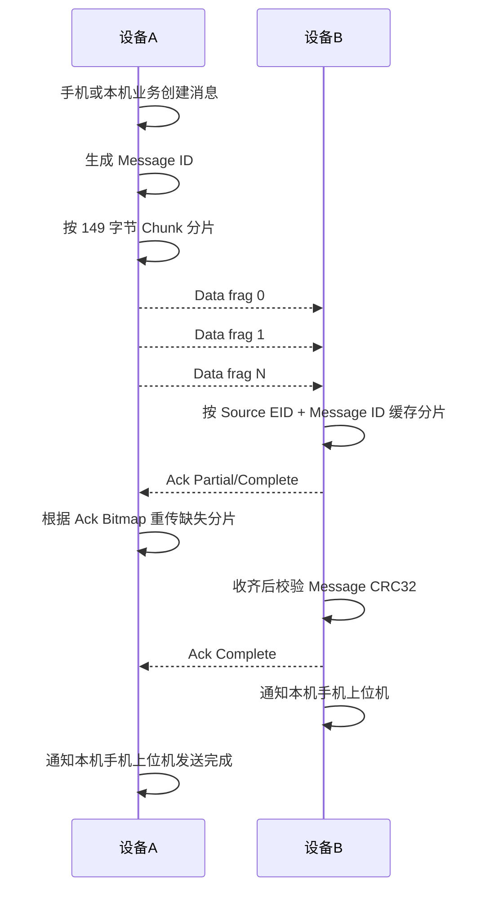

# 蓝牙吊坠扩展广播设备间通信协议

## 1. 设计目标

本文档定义蓝牙吊坠设备之间的通信协议。

设计约束：

- 设备之间不建立 BLE 连接。
- 设备之间不使用 GATT、ATT、L2CAP Credit Based Channel 等蓝牙上层协议。
- 设备之间只使用 BLE Extended Advertising 和 Scanning。
- 业务数据放在 Extended Advertising Data 的 Manufacturer Specific Data 中。
- 协议自身负责设备识别、分片、重组、去重、确认、超时和完整性校验。

手机上位机与本机吊坠之间仍使用 BLE GATT 通信。本文档只描述吊坠设备之间的广播通信。

## 2. 协议命名

协议名称：

- `PENDANT-ADV`

协议版本：

- `0x01`

文档中所有多字节整数默认使用 little-endian。

## 3. 广播数据承载方式

设备间通信使用 Extended Advertising Data 中的单个 AD Structure：

| 字段 | 长度 | 值 | 说明 |
| --- | ---: | --- | --- |
| AD Length | 1 | N | 后续 AD Type + AD Data 的长度 |
| AD Type | 1 | `0xFF` | Manufacturer Specific Data |
| Company ID | 2 | 待定 | Bluetooth SIG Company Identifier，未申请前可用测试值 |
| Vendor Payload | 可变 | `PENDANT-ADV` 帧 | 本协议数据 |

Company ID：

- 量产前应申请或确定正式 Company ID。
- 开发阶段可使用测试值，例如 `0xFFFF`，但不得用于量产固件。

长度约束：

- 当前 Telink SDK 示例中扩展广播数据缓冲区配置为 318 字节。
- `blc_ll_setExtAdvData()` 的长度参数为 `u8`，实际单次设置建议控制在 255 字节以内。
- 单个 Manufacturer Specific Data AD Structure 的长度字段为 1 字节，因此单个 AD Structure 最大 255 字节。
- 本协议 v1 规定单帧 Extended Advertising Data 总长度不超过 240 字节，给 SDK、调试字段和后续扩展预留空间。

## 4. 帧类型

| 帧类型 | 值 | 名称 | 是否需要 ACK | 说明 |
| --- | ---: | --- | --- | --- |
| Beacon | `0x01` | 发现广播帧 | 否 | 周期性广播本机状态，用于发现和 RSSI 判断 |
| Data | `0x10` | 业务数据分片帧 | 可选 | 发送设备间业务消息 |
| Ack | `0x11` | 确认帧 | 否 | 确认已收到的 Data 分片 |
| Ctrl | `0x12` | 控制帧 | 否 | Busy、Cancel、Ping 等控制信息 |
| Error | `0x13` | 错误帧 | 否 | 广播错误状态或协议错误 |

## 5. 通用帧格式

Vendor Payload 统一格式如下：

| 偏移 | 字段 | 长度 | 说明 |
| ---: | --- | ---: | --- |
| 0 | Magic | 2 | 固定为 `0x44 0x50`，ASCII 为 `DP` |
| 2 | Protocol Version | 1 | 当前为 `0x01` |
| 3 | Header Length | 1 | 当前固定为 `50` |
| 4 | Frame Type | 1 | 见帧类型表 |
| 5 | Flags | 1 | 通用标志位 |
| 6 | Key ID | 1 | 当前使用的广播身份或加密 key 版本 |
| 7 | Device State | 1 | 发送方系统状态 |
| 8 | Frame Seq | 2 | 发送方广播帧递增序号 |
| 10 | Source EID | 16 | 发送方加密派生设备标识 |
| 26 | Destination EID | 16 | 目标设备标识，全 0 表示广播 |
| 42 | Message ID | 4 | 消息 ID，Beacon 可为 0 |
| 46 | Fragment Index | 1 | 分片序号，从 0 开始 |
| 47 | Fragment Count | 1 | 分片总数，单帧为 1 |
| 48 | Payload Length | 1 | Payload 字节数 |
| 49 | Header CRC8 | 1 | Header 前 49 字节 CRC8 |
| 50 | Payload | 可变 | 帧载荷 |
| 50+N | Frame CRC32 | 4 | Header + Payload 的 CRC32 |

总帧长度：

- `50 + Payload Length + 4`。

推荐 Payload 最大长度：

- `160` 字节。

推荐单帧 Vendor Payload 最大长度：

- `214` 字节。

Flags 定义：

| bit | 名称 | 说明 |
| ---: | --- | --- |
| 0 | Ack Required | Data 帧是否要求 ACK |
| 1 | Payload Encrypted | Payload 是否加密 |
| 2 | Payload MIC | Payload 是否带消息认证码 |
| 3 | Low Power | 发送方处于低功耗倾向 |
| 4 | Charging | 发送方正在充电 |
| 5 | Error Present | 发送方存在错误 |
| 6 | Reserved | 保留 |
| 7 | Reserved | 保留 |

Device State 定义：

| 值 | 状态 |
| ---: | --- |
| `0x00` | Unknown |
| `0x01` | Boot |
| `0x02` | Self Check |
| `0x03` | Adv Scan |
| `0x04` | App Connected |
| `0x05` | Sleep Prepare |
| `0x06` | Error |

## 6. 设备标识

### 6.1 Source EID

`Source EID` 是 128bit 广播身份标识，不直接使用唯一识别码明文。

建议生成方式：

```text
Source EID = AES-128(ProductKey, UniqueID)
```

如果后续要求防跟踪，应改为滚动 EID：

```text
Source EID = AES-128(ProductKey, UniqueID XOR Epoch)
```

其中 `Epoch` 可按 15 分钟、1 小时或每天变化。

### 6.2 Destination EID

`Destination EID` 用于单播消息。

取值：

- 全 0：广播消息，任何合法设备都可处理。
- 非 0：仅目标 EID 匹配的设备处理。

如果后续启用滚动 EID，手机上位机和本机固件需要维护“附近设备显示 ID”和“当前 EID”的映射。

## 7. Beacon 帧

Beacon 帧用于设备发现、RSSI 判断和基础状态广播。

Header 设置：

- Frame Type = `0x01`。
- Destination EID = 全 0。
- Message ID = 0。
- Fragment Index = 0。
- Fragment Count = 1。
- Ack Required = 0。

Beacon Payload：

| 偏移 | 字段 | 长度 | 说明 |
| ---: | --- | ---: | --- |
| 0 | Product Type | 1 | 产品类型，吊坠为 `0x01` |
| 1 | Hardware Version | 1 | 硬件版本 |
| 2 | Firmware Major | 1 | 固件主版本 |
| 3 | Firmware Minor | 1 | 固件次版本 |
| 4 | Firmware Patch | 1 | 固件补丁版本 |
| 5 | Battery Percent | 1 | 电量百分比，0-100，未知为 255 |
| 6 | Battery mV | 2 | 电池电压，单位 mV |
| 8 | Charge State | 1 | 0 未充电，1 充电中，2 充满，255 未知 |
| 9 | Discovery Level | 1 | 本机对外显示状态，默认 0 |
| 10 | Peer Count | 1 | 当前附近设备数量 |
| 11 | Capability Flags | 2 | 能力位 |
| 13 | Error Code | 2 | 无错误为 0 |
| 15 | Motion Counter | 2 | 动作计数，低 16 bit |
| 17 | Uptime Seconds | 4 | 本次启动运行秒数 |
| 21 | Reserved | 可变 | 保留 |

Capability Flags：

| bit | 说明 |
| ---: | --- |
| 0 | 支持可靠 Data + Ack |
| 1 | 支持加密 Payload |
| 2 | 支持 MIC |
| 3 | 支持滚动 EID |
| 4 | 支持马达反馈 |
| 5 | 支持充电检测 |
| 6 | 支持电池电压上报 |
| 7-15 | 保留 |

Beacon 广播周期：

- 正常工作：建议 100-500 ms。
- 低功耗倾向：建议 500-1000 ms。
- 正在发送消息：Beacon 不应完全停止，建议每 3-5 个广播事件至少发送 1 次 Beacon。

## 8. Data 帧

Data 帧用于发送设备间业务消息。

Header 设置：

- Frame Type = `0x10`。
- Destination EID = 目标设备 EID，广播消息可为全 0。
- Message ID = 发送方生成的 32bit 随机数或递增序号。
- Fragment Index = 当前分片序号。
- Fragment Count = 总分片数。
- Ack Required 根据消息可靠性要求设置。

Data Payload：

| 偏移 | 字段 | 长度 | 说明 |
| ---: | --- | ---: | --- |
| 0 | App Message Type | 1 | 上层业务消息类型 |
| 1 | App Flags | 1 | 业务标志 |
| 2 | Total Length | 2 | 完整业务消息长度 |
| 4 | Message CRC32 | 4 | 完整业务消息明文或密文 CRC32 |
| 8 | Offset | 2 | 当前 Chunk 在完整消息中的偏移 |
| 10 | Chunk Length | 1 | 当前 Chunk 长度 |
| 11 | Chunk Data | 可变 | 当前分片数据 |

推荐限制：

- 单个 Chunk 最大 149 字节。
- 单条消息最大 1024 字节。
- 单条消息最多 8 个分片。
- 如果后续 SRAM 允许，可扩展到 2048 或 4096 字节。

App Message Type：

| 值 | 名称 | 说明 |
| ---: | --- | --- |
| `0x01` | Text | UTF-8 文本消息 |
| `0x02` | Binary | 小型二进制消息 |
| `0x03` | Reaction | 简单回应，例如收到、确认、表情 |
| `0x04` | Presence | 用户在线或靠近状态 |
| `0x05` | App Event | 上位机自定义事件 |
| `0x80`-`0xFF` | Vendor Private | 私有扩展 |

App Flags：

| bit | 说明 |
| ---: | --- |
| 0 | 此消息需要送达确认 |
| 1 | 此消息需要通知手机 |
| 2 | 此消息为手机上位机发起 |
| 3 | 此消息为设备自动发起 |
| 4 | 消息内容已压缩 |
| 5-7 | 保留 |

## 9. Ack 帧

Ack 帧用于确认 Data 帧接收情况。

Header 设置：

- Frame Type = `0x11`。
- Source EID = ACK 发送方。
- Destination EID = 原 Data 发送方。
- Message ID = 被确认的 Message ID。
- Fragment Index = 0。
- Fragment Count = 1。

Ack Payload：

| 偏移 | 字段 | 长度 | 说明 |
| ---: | --- | ---: | --- |
| 0 | Ack Status | 1 | 确认状态 |
| 1 | Received Bitmap | 4 | 已收到分片位图，bit0 表示分片 0 |
| 5 | Missing Index | 1 | 第一个缺失分片，全部收到为 255 |
| 6 | Message CRC32 | 4 | 完整消息 CRC32，未收齐时为 0 |
| 10 | Reason Code | 1 | 状态原因 |

Ack Status：

| 值 | 名称 | 说明 |
| ---: | --- | --- |
| `0x00` | Partial | 已收到部分分片 |
| `0x01` | Complete | 已完整收到并校验通过 |
| `0x02` | Duplicate | 消息重复，之前已处理 |
| `0x03` | Rejected | 拒绝接收 |
| `0x04` | Busy | 当前缓存不足或正在处理其他消息 |
| `0x05` | CRC Error | 收齐后 CRC 校验失败 |

ACK 发送策略：

- 收到需要 ACK 的 Data 分片后，接收方应在 200 ms 内开始广播 Ack。
- 未收齐时广播 Partial ACK，帮助发送方重传缺失分片。
- 收齐并校验通过后广播 Complete ACK。
- Complete ACK 至少重复广播 5 次，或持续 2 秒。

## 10. Ctrl 帧

Ctrl 帧用于轻量控制，不承载大业务数据。

Header 设置：

- Frame Type = `0x12`。
- Message ID 可为被控制消息的 Message ID。

Ctrl Payload：

| 偏移 | 字段 | 长度 | 说明 |
| ---: | --- | ---: | --- |
| 0 | Control Type | 1 | 控制类型 |
| 1 | Reference Message ID | 4 | 关联消息 ID |
| 5 | Code | 1 | 控制码 |
| 6 | Extra | 可变 | 扩展数据 |

Control Type：

| 值 | 名称 | 说明 |
| ---: | --- | --- |
| `0x01` | Ping | 探测对端协议能力 |
| `0x02` | Pong | Ping 响应 |
| `0x03` | Busy | 当前忙 |
| `0x04` | Cancel | 取消指定消息 |
| `0x05` | Request Retransmit | 请求重传 |

## 11. Error 帧

Error 帧用于广播设备或协议错误。

Header 设置：

- Frame Type = `0x13`。
- Destination EID 可为全 0。
- Flags 中 `Error Present` 置 1。

Error Payload：

| 偏移 | 字段 | 长度 | 说明 |
| ---: | --- | ---: | --- |
| 0 | Error Domain | 1 | 错误域 |
| 1 | Error Code | 2 | 错误码 |
| 3 | Last State | 1 | 错误发生前状态 |
| 4 | Recoverable | 1 | 0 不可恢复，1 可恢复 |
| 5 | Detail | 可变 | 调试详情，量产可为空 |

Error Domain：

| 值 | 说明 |
| ---: | --- |
| `0x01` | 系统状态机 |
| `0x02` | Flash/唯一 ID |
| `0x03` | BLE 广播扫描 |
| `0x04` | 马达驱动 |
| `0x05` | 电池/充电 |
| `0x06` | 协议解析 |
| `0x07` | 安全认证 |

## 12. 发送流程

### 12.1 可靠单播消息



发送方规则：

1. 创建发送任务。
2. 生成 32bit `Message ID`。
3. 计算完整消息 `Message CRC32`。
4. 计算分片总数。
5. 进入消息发送窗口。
6. 在扩展广播中轮询发送 Data 分片。
7. 监听目标设备 Ack。
8. 根据 Ack bitmap 重发缺失分片。
9. 收到 Complete ACK 后结束任务。
10. 超时或超过最大重试次数后上报失败。

默认参数建议：

| 参数 | 默认值 |
| --- | ---: |
| 单分片重复次数 | 3 |
| ACK 等待时间 | 1000 ms |
| 消息总超时 | 8000 ms |
| 最大重试轮次 | 5 |
| ACK Complete 重复时间 | 2000 ms |

### 12.2 非可靠广播消息

用于无需确认的状态通知。

规则：

- Destination EID 为全 0。
- Ack Required = 0。
- 每个分片按固定次数重复广播。
- 不等待 ACK。
- 发送完成只表示“本机已广播完成”，不表示对端已收到。

默认参数建议：

| 参数 | 默认值 |
| --- | ---: |
| 单分片重复次数 | 5 |
| 发送窗口 | 2000 ms |

## 13. 接收流程

扫描到 Manufacturer Specific Data 后执行：

1. 检查 AD Type 是否为 `0xFF`。
2. 检查 Company ID 是否匹配。
3. 检查 Magic 是否为 `DP`。
4. 检查协议版本是否支持。
5. 检查 Header Length 是否支持。
6. 校验 Header CRC8。
7. 校验 Frame CRC32。
8. 根据 Source EID 更新附近设备表和 RSSI。
9. 根据 Frame Type 进入不同处理流程。

Data 接收规则：

- 如果 Destination EID 非全 0 且不等于本机 EID，则忽略业务内容，但仍可用于 RSSI 发现。
- 如果消息已处理过，则发送 Duplicate ACK。
- 如果缓存不足，则发送 Busy ACK。
- 如果分片合法，则写入接收缓存。
- 收齐后校验 `Message CRC32`。
- 校验通过后投递给本机上位机通知队列。

## 14. 去重和缓存

### 14.1 去重键

Data 消息去重键：

```text
Source EID + Message ID + Message CRC32
```

Frame 去重键：

```text
Source EID + Frame Seq
```

### 14.2 缓存建议

附近设备表：

- 32 条。

接收消息缓存：

- 2 条并发接收任务。
- 每条最大 1024 字节。

已完成消息去重表：

- 16 条。
- 保留 10 分钟或直到设备休眠。

待发送消息队列：

- 4 条。
- 手机可查询队列状态。

## 15. 广播调度

由于当前工程只配置了 1 个扩展广播集，所有帧类型需要复用同一个广告集轮流发送。

建议调度策略：

### 15.1 空闲状态

- 持续发送 Beacon。
- 广播间隔建议 100-500 ms。

### 15.2 发送 Data 状态

广播事件按比例轮询：

| 比例 | 帧 |
| ---: | --- |
| 3/5 | Data |
| 1/5 | Beacon |
| 1/5 | Ack 或 Ctrl，如果无待发则发 Data |

发送窗口内建议临时缩短广播间隔到 50-100 ms。

### 15.3 接收后 ACK 状态

广播事件按比例轮询：

| 比例 | 帧 |
| ---: | --- |
| 2/5 | Ack |
| 2/5 | Beacon |
| 1/5 | Data 或 Ctrl |

### 15.4 错误状态

- 优先发送 Error。
- 每 3-5 个 Error 帧插入 1 个 Beacon。

## 16. RSSI 发现与通信的关系

RSSI 发现使用扫描报告中控制器提供的 RSSI，不使用协议帧内字段。

Beacon、Data、Ack、Ctrl、Error 都可用于更新附近设备的最后出现时间和 RSSI。

建议：

- 只有 Beacon 用于计算稳定发现状态 S1/S2/S3。
- Data/Ack/Ctrl/Error 只刷新设备活跃时间，不参与 RSSI 等级切换。

这样可以避免消息发送期间广播频率变化影响距离判断。

## 17. 完整性和安全

### 17.1 基础完整性

必须实现：

- Header CRC8。
- Frame CRC32。
- Message CRC32。

Header CRC8 用于快速过滤错误帧。

Frame CRC32 用于单个广播帧完整性校验。

Message CRC32 用于完整业务消息重组后的完整性校验。

### 17.2 防伪造和认证

CRC 不防伪造。若需要防止伪造设备或伪造消息，应启用 MIC。

建议：

- 使用 AES-CMAC 生成 4 或 8 字节 MIC。
- MIC 输入覆盖 Header 关键字段和 Payload。
- MIC key 由产品级 key 或批次 key 派生。

Payload MIC 开启时，`Flags bit2` 置 1。

### 17.3 加密

如果业务消息不希望被旁路扫描者读取，应启用 Payload 加密。

建议：

- 使用 AES-CTR 或 AES-CCM。
- Nonce 可由 `Source EID + Message ID + Fragment Index` 派生。
- 加密范围为 Data Payload 中的业务 Chunk。

Payload Encrypted 开启时，`Flags bit1` 置 1。

待确认：

- 量产是否必须启用 MIC。
- 量产是否必须启用 Payload 加密。
- ProductKey 和批次 key 的烧录、保护、更新机制。

## 18. 错误处理

协议错误处理：

| 错误 | 处理 |
| --- | --- |
| Company ID 不匹配 | 忽略 |
| Magic 不匹配 | 忽略 |
| 版本不支持 | 可发送 Ctrl Busy 或忽略 |
| Header CRC8 错误 | 忽略 |
| Frame CRC32 错误 | 忽略 |
| Destination EID 不匹配 | 不处理业务内容 |
| Fragment Count 超限 | Ack Rejected |
| Payload Length 超限 | Ack Rejected |
| 缓存不足 | Ack Busy |
| Message CRC32 错误 | Ack CRC Error |

## 19. 与手机上位机的事件映射

设备间通信事件需要通过 GATT 通知本机手机上位机。

上报事件：

- 发现新设备。
- 设备发现等级变化。
- 收到对端消息分片。
- 收到完整对端消息。
- 发送任务进度。
- 发送成功。
- 发送失败。
- 收到 ACK。
- 对端 Busy。
- 协议错误。

手机上位机不直接参与设备间广播协议解析。手机只通过连接的本机吊坠读取和控制这些事件。

## 20. 固件模块建议

建议新增模块：

- `app_adv_proto.h`
- `app_adv_proto.c`
- `app_peer_table.h`
- `app_peer_table.c`
- `app_peer_tx.h`
- `app_peer_tx.c`
- `app_peer_rx.h`
- `app_peer_rx.c`

核心接口：

```c
void app_adv_proto_init(void);
int app_adv_proto_build_next_frame(unsigned char *buf, unsigned char max_len);
int app_adv_proto_parse_frame(const unsigned char *data, unsigned char len, signed char rssi);

int app_peer_send_message(const unsigned char dst_eid[16],
                          unsigned char app_type,
                          const unsigned char *payload,
                          unsigned short payload_len,
                          unsigned char reliable);

void app_peer_tx_poll(void);
void app_peer_rx_poll(void);
```

实现注意：

- 广播数据构建必须避免在中断或 BLE 回调中做重计算。
- 扫描解析只做轻量校验和入队，完整处理放到主循环。
- 所有发送任务必须可被休眠准备流程取消或标记失败。
- 单个广播帧长度应在构建后统一检查，超过限制则拒绝发送。

## 21. 待确认问题

1. 正式 Company ID。
2. 量产是否启用滚动 EID。
3. 是否强制启用 MIC。
4. 是否强制加密业务消息。
5. 单条设备间消息最大长度。
6. 并发发送和接收缓存数量。
7. 默认广播间隔和消息发送窗口。
8. ACK 超时和重试参数。
9. 是否允许全 0 Destination EID 的可靠广播。
10. 手机上位机是否需要显示对端真实唯一识别码，还是只显示派生昵称和短 ID。
