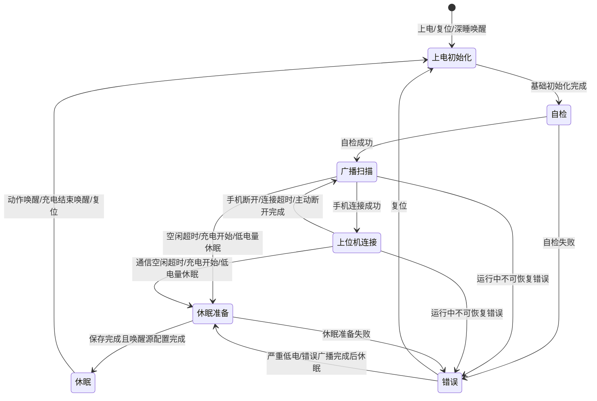

# 蓝牙吊坠状态机设计

## 1. 设计目标

本文档定义蓝牙吊坠下位机的系统状态、状态跳转、事件优先级和关键动作。

状态机设计目标：

- 明确设备上电、唤醒、连接、扫描、发现、错误和休眠之间的关系。
- 保证手机连接状态下仍可执行设备间广播扫描。
- 保证进入低功耗前完成必要的断开、保存和外设关闭动作。
- 为后续固件实现提供可直接落地的状态枚举和事件枚举。

## 2. 状态定义

建议固件使用以下主状态：

| 状态 | 建议枚举 | 说明 |
| --- | --- | --- |
| 上电初始化 | `SYS_STATE_BOOT` | 上电、复位、深睡唤醒后的最早状态 |
| 自检 | `SYS_STATE_SELF_CHECK` | 检查 Flash、唯一 ID、电池、充电、外设和配置 |
| 广播扫描 | `SYS_STATE_ADV_SCAN` | 正常工作态，广播本机并扫描其他设备 |
| 上位机连接 | `SYS_STATE_APP_CONNECTED` | 手机已连接，同时继续广播扫描 |
| 休眠准备 | `SYS_STATE_SLEEP_PREPARE` | 断开连接、停止广播扫描、保存状态、配置唤醒源 |
| 休眠 | `SYS_STATE_SLEEP` | 芯片低功耗状态 |
| 错误 | `SYS_STATE_ERROR` | 自检失败或运行中不可恢复错误 |

说明：

- `SYS_STATE_SLEEP_PREPARE` 是一个短暂过渡状态，不长期停留。
- `SYS_STATE_SLEEP` 进入后 MCU 代码通常停止运行，唤醒后重新从 `SYS_STATE_BOOT` 开始。
- 如果后续确认“充电中需要保留 BLE 能力”，可新增 `SYS_STATE_CHARGING`，不要把充电逻辑塞进普通休眠状态。

## 3. 状态机跳转图



## 4. 状态行为

### 4.1 上电初始化

进入条件：

- 芯片上电。
- 硬复位。
- 软件复位。
- 从 deep sleep 或 deep sleep retention 唤醒。

必须执行：

- 选择并初始化系统时钟。
- 初始化基础 GPIO。
- 初始化 UART 调试能力。
- 读取唤醒原因。
- 初始化 BLE 运行所需基础模块。
- 初始化系统 tick 和软件定时器。

退出条件：

- 基础初始化完成后进入自检状态。

禁止行为：

- 不处理手机命令。
- 不处理设备间消息。
- 不触发马达提示，除非后续定义专用启动提示。

### 4.2 自检

必须检查：

- Flash 容量识别和分区地址。
- BLE MAC 地址。
- 唯一识别码是否存在。
- 唯一识别码校验是否通过。
- 配置参数是否存在。
- 配置参数版本是否兼容。
- 电池电压是否高于最低运行阈值。
- 充电检测引脚是否可读。
- 振动检测引脚是否可读。
- 马达驱动是否可初始化。
- BLE 广播和扫描模块初始化是否成功。
- GATT 服务是否初始化成功。

成功后动作：

- 生成或加载当前广播 UUID。
- 初始化广播帧。
- 初始化附近设备表。
- 初始化广播通信收发队列。
- 进入广播扫描状态。

失败后动作：

- 写入当前错误码。
- 进入错误状态。

### 4.3 广播扫描

必须执行：

- 周期性更新扩展广播厂商自定义内容。
- 保持扫描其他吊坠设备的扩展广播。
- 运行 RSSI 发现算法。
- 维护附近设备表。
- 处理设备间广播通信。
- 允许手机发起 BLE 连接。
- 启动普通空闲休眠计时。

空闲计时复位条件：

- 检测到有效动作。
- 附近存在 S1/S2/S3 设备。
- 收到合法设备间消息。
- 有待发送设备间消息。
- 手机连接成功。

退出条件：

- 手机连接成功，进入上位机连接状态。
- 满足休眠条件，进入休眠准备状态。
- 发生不可恢复错误，进入错误状态。

### 4.4 上位机连接

必须执行：

- 保持 GATT 命令通道。
- 继续更新扩展广播厂商自定义内容。
- 继续扫描其他吊坠设备。
- 继续运行 RSSI 发现算法。
- 继续处理设备间广播通信。
- 将发现事件、消息收发事件、错误事件通知手机。
- 接收手机配置和消息发送命令。

休眠计时策略：

- 普通无动作休眠计时暂停。
- 手机通信空闲计时启动。
- 如果手机长时间无命令且无未完成设备间通信，可主动通知手机并断开。

退出条件：

- 手机主动断开。
- 设备主动断开。
- 手机通信空闲超时。
- 充电开始且策略要求断开。
- 严重低电。
- 发生不可恢复错误。

### 4.5 休眠准备

必须执行：

1. 设置系统状态为休眠准备。
2. 如果手机已连接，通知手机即将休眠。
3. 等待通知发送窗口，或达到最大等待时间。
4. 主动断开手机连接。
5. 停止扫描。
6. 停止扩展广播。
7. 停止马达。
8. 保存必要配置和统计状态。
9. 配置动作检测唤醒源。
10. 配置充电检测唤醒源。
11. 关闭 UART、I2C、ADC 等非必要外设。
12. 进入低功耗模式。

异常处理：

- 如果保存状态失败，进入错误状态。
- 如果外设关闭失败但不影响低功耗安全，可继续休眠并记录错误标志。

### 4.6 休眠

唤醒源：

- 振动检测电路发生动作。
- 充电结束。
- 复位。

唤醒后动作：

- 重新进入上电初始化状态。
- 读取唤醒原因。
- 执行完整自检。

待确认：

- 充电开始是否也作为唤醒源。
- deep sleep 与 deep sleep retention 的最终选择。
- 是否保留附近设备表。

### 4.7 错误

错误状态行为按错误等级区分：

| 错误等级 | 行为 |
| --- | --- |
| 一般错误 | 广播错误码，允许手机连接读取错误 |
| 严重错误 | 广播错误码一段时间后进入休眠 |
| 致命错误 | 停止业务，仅等待复位或进入最低功耗 |

错误状态必须保留：

- 主错误码。
- 子错误码。
- 最近一次系统状态。
- 最近一次唤醒原因。
- 错误发生时间 tick。

待确认：

- 错误状态是否允许手机连接。
- 错误广播持续时间。
- 低电错误是否允许马达提示。

## 5. 事件定义

建议固件使用以下系统事件：

| 事件 | 建议枚举 | 来源 |
| --- | --- | --- |
| 上电完成 | `SYS_EVT_BOOT_DONE` | 初始化流程 |
| 自检成功 | `SYS_EVT_SELF_CHECK_OK` | 自检流程 |
| 自检失败 | `SYS_EVT_SELF_CHECK_FAIL` | 自检流程 |
| 手机连接 | `SYS_EVT_APP_CONNECTED` | BLE 连接回调 |
| 手机断开 | `SYS_EVT_APP_DISCONNECTED` | BLE 断开回调 |
| 手机命令 | `SYS_EVT_APP_COMMAND` | GATT 写入 |
| 手机空闲超时 | `SYS_EVT_APP_IDLE_TIMEOUT` | 软件定时器 |
| 扫描到合法设备 | `SYS_EVT_PEER_SEEN` | 扫描回调 |
| 设备发现状态变化 | `SYS_EVT_PEER_LEVEL_CHANGED` | RSSI 算法 |
| 收到设备间消息 | `SYS_EVT_PEER_MESSAGE_RX` | 广播协议 |
| 设备间消息发送完成 | `SYS_EVT_PEER_MESSAGE_TX_DONE` | 广播协议 |
| 普通空闲超时 | `SYS_EVT_IDLE_TIMEOUT` | 软件定时器 |
| 动作检测 | `SYS_EVT_MOTION_DETECTED` | GPIO/唤醒源 |
| 充电开始 | `SYS_EVT_CHARGE_STARTED` | GPIO |
| 充电结束 | `SYS_EVT_CHARGE_STOPPED` | GPIO/唤醒源 |
| 电池低电 | `SYS_EVT_BATTERY_LOW` | ADC |
| 电池严重低电 | `SYS_EVT_BATTERY_CRITICAL` | ADC |
| 不可恢复错误 | `SYS_EVT_FATAL_ERROR` | 任意模块 |
| 休眠准备完成 | `SYS_EVT_SLEEP_READY` | 休眠流程 |

## 6. 事件优先级

当多个事件同时出现时，按以下优先级处理：

1. 致命错误。
2. 电池严重低电。
3. 充电开始。
4. 手机连接和断开。
5. 手机命令。
6. 设备间广播通信收发。
7. 附近设备发现状态变化。
8. 普通动作检测。
9. 普通空闲超时。

说明：

- 手机命令不应打断致命错误和严重低电处理。
- 发现事件和广播消息可以排队处理，不建议在扫描回调里做重逻辑。
- 马达振动应由独立队列执行，避免阻塞 BLE 主循环。

## 7. 状态跳转表

| 当前状态 | 事件 | 条件 | 下一状态 | 动作 |
| --- | --- | --- | --- | --- |
| 上电初始化 | 上电完成 | 基础初始化成功 | 自检 | 开始自检 |
| 自检 | 自检成功 | 全部必需项通过 | 广播扫描 | 启动广播扫描 |
| 自检 | 自检失败 | 任一必需项失败 | 错误 | 保存错误码 |
| 广播扫描 | 手机连接 | 连接成功 | 上位机连接 | 停止普通休眠计时 |
| 广播扫描 | 普通空闲超时 | 无动作且无附近设备 | 休眠准备 | 准备低功耗 |
| 广播扫描 | 充电开始 | 策略为充电休眠 | 休眠准备 | 通知并停止业务 |
| 广播扫描 | 电池严重低电 | 低于关机阈值 | 休眠准备 | 低电保护 |
| 广播扫描 | 不可恢复错误 | 错误不可恢复 | 错误 | 保存错误码 |
| 上位机连接 | 手机断开 | 正常断开 | 广播扫描 | 重置普通休眠计时 |
| 上位机连接 | 手机空闲超时 | 无命令且无通信任务 | 休眠准备 | 通知手机并断开 |
| 上位机连接 | 充电开始 | 策略为充电休眠 | 休眠准备 | 通知手机并断开 |
| 上位机连接 | 电池严重低电 | 低于关机阈值 | 休眠准备 | 通知手机并断开 |
| 上位机连接 | 不可恢复错误 | 错误不可恢复 | 错误 | 通知错误或广播错误 |
| 休眠准备 | 休眠准备完成 | 唤醒源配置完成 | 休眠 | 进入低功耗 |
| 休眠准备 | 不可恢复错误 | 保存或配置失败 | 错误 | 保存错误码 |
| 休眠 | 动作检测 | GPIO 唤醒 | 上电初始化 | 读取唤醒原因 |
| 休眠 | 充电结束 | GPIO 唤醒 | 上电初始化 | 读取唤醒原因 |
| 错误 | 复位 | 任意 | 上电初始化 | 重新初始化 |
| 错误 | 错误广播完成 | 严重错误 | 休眠准备 | 进入保护休眠 |

## 8. 固件实现建议

建议实现一个轻量系统状态机模块：

- `app_system.h`
- `app_system.c`

核心接口：

```c
typedef enum {
    SYS_STATE_BOOT = 0,
    SYS_STATE_SELF_CHECK,
    SYS_STATE_ADV_SCAN,
    SYS_STATE_APP_CONNECTED,
    SYS_STATE_SLEEP_PREPARE,
    SYS_STATE_SLEEP,
    SYS_STATE_ERROR,
} app_system_state_t;

typedef enum {
    SYS_EVT_BOOT_DONE = 0,
    SYS_EVT_SELF_CHECK_OK,
    SYS_EVT_SELF_CHECK_FAIL,
    SYS_EVT_APP_CONNECTED,
    SYS_EVT_APP_DISCONNECTED,
    SYS_EVT_APP_COMMAND,
    SYS_EVT_APP_IDLE_TIMEOUT,
    SYS_EVT_PEER_SEEN,
    SYS_EVT_PEER_LEVEL_CHANGED,
    SYS_EVT_PEER_MESSAGE_RX,
    SYS_EVT_PEER_MESSAGE_TX_DONE,
    SYS_EVT_IDLE_TIMEOUT,
    SYS_EVT_MOTION_DETECTED,
    SYS_EVT_CHARGE_STARTED,
    SYS_EVT_CHARGE_STOPPED,
    SYS_EVT_BATTERY_LOW,
    SYS_EVT_BATTERY_CRITICAL,
    SYS_EVT_FATAL_ERROR,
    SYS_EVT_SLEEP_READY,
} app_system_event_t;

void app_system_init(void);
void app_system_poll(void);
void app_system_post_event(app_system_event_t event, const void *data, unsigned int len);
app_system_state_t app_system_get_state(void);
```

实现约束：

- BLE 回调中只投递事件，不执行耗时逻辑。
- 扫描回调中只解析最小必要字段并入队。
- 马达振动、Flash 写入、广播重发都在主循环或软件定时器中处理。
- 所有状态跳转必须集中在状态机模块，避免分散在 `main.c`、`app.c` 和外设驱动中。

## 9. 与当前工程的对应关系

当前工程中已有：

- `main.c` 主循环。
- `task250ms()` 周期任务。
- `controllerInitialization()` BLE 初始化。
- `task_connect()` 手机连接事件。
- `task_terminate()` 手机断开事件。
- `blm_le_adv_report_event_handle()` 扫描报告解析。
- 简单深睡逻辑。

需要调整：

- 将 `task250ms()` 中的休眠计数迁移到状态机。
- 将 `device_in_connection_state` 替换为系统状态判断。
- 将扫描到的广播报告转为设备发现事件。
- 将休眠前的断连、停广播、停扫描、保存状态集中到 `SYS_STATE_SLEEP_PREPARE`。
- 将错误处理集中到 `SYS_STATE_ERROR`。
